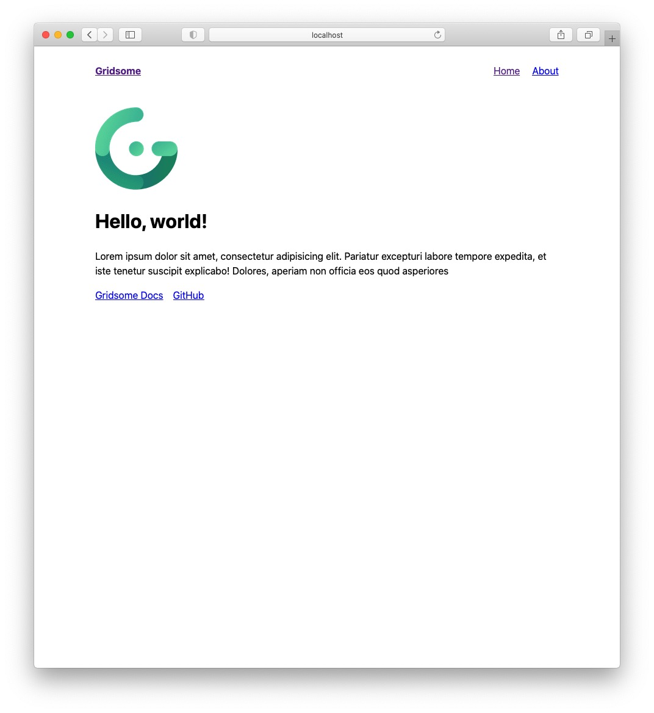

## Gridsome とはなにか

ざっくりいうと**Vue.js 版の Gatsby**です。

Vue.js のフレームワーク on フレームワークで、JAMStack(JavaScript + APIs + Markup)です。

ようするに、React ベースのこのブログの Vue.js ベース版を試しに作ってみようという試みです。

## Gridsome のインストール

とりあえずローカルホストで立ち上がるところまで確認してみましょう。

```bash
$ npx gridsome create gridsome-thanaism
$ cd gridsome-thanaism
$ npm i @gridsome/cli
$ npx gridsome develop
```

難なくウェルカムページを拝むことができました。



## Markdown 形式への対応

素の js の状態では Markdown は扱えないため、Gatsby でいう Remark プラグイン的なものを導入する必要があります。

- `@gridsome/source-filesystem`
- `@gridsome/vue-remark`

上記のどちらかを使えばいいっぽいです。両方とも Gridsome のプラグインとして提供されています。  
主な違いとしては`vue-remark`のほうは Markdown に Vue.js のコンポーネントを組み込めるようです。

が、記事の可搬性を考えたときにプラットフォームへの依存性はあまり強めたくないので、今回は`source-filesystem`を使うことにしました。

```bash
$ npm i @gridsome/source-filesystem
```

Gatsby と同様にプラグインを入れたら Gridsome に使っていることを教えるために設定を書き換える必要があります。  
以下のように`gridsome.config.js`を書き換えればよいです。

<!-- prettier-ignore-start -->
```js
module.exports = {
  siteName: 'Gridsome',
  plugins: [
    {
      use: '@gridsome/source-filesystem',
      options: {
        path: 'content/posts/**/*.md',
        typeName: 'Post',
      }
    }
  ]
}
```
<!-- prettier-ignore-end -->

## TypeScript の導入

Gridsome はデフォルトだと js です。何はともあれ TypeScript を使いたいので導入します。

公式だと yarn が推奨されていますが、npm を理解しないうちに yarn を使っちゃ**やーん**ということで npm でインストールします。あっ、まって。ブラウザバックしないで。

```bash
$ npm i --save-dev typescript ts-loader gridsome-plugin-typescript
```

プラグインを入れたので、再度`gridsome.config.js`を書き換えます。  
以下を追記します。

<!-- prettier-ignore-start -->
```js
plugins: [
  {
    use: 'gridsome-plugin-typescript',
  }
]
```
<!-- prettier-ignore-end -->

続いて、`tsconfig.json`をプロジェクトフォルダ直下に追加します。

```json
{
  "compilerOptions": {
    "target": "es5",
    "module": "es2015",
    "moduleResolution": "node",
    "noImplicitReturns": true,
    "outDir": "./built/",
    "sourceMap": true,
    "strict": true
  },
  "include": ["./src/**/*"]
}
```

最後に、`vue-shims.d.ts`ファイルを`src`フォルダ直下に追加します。  
`.vue`ファイルを TypeScript に読み込ませるためのものです。

```ts
declare module '*.vue' {
  import Vue from 'vue';
  export default Vue;
}
```

ここまでくれば Gridsome で TypeScript が使用できるはずです。
満を持してコンポーネントの`<script>`タグを`<script lang="ts">`に置き換えてしまいましょう。

`$ npx gridsome develop`して、ちゃんと立ち上がることを確認しておきます。

## Vue.js の基本

そもそも Gridsome の前に Vue.js の使い方がよく分かっていないので、サクッとさらっていきます。

とりあえず、`gridsome create`で自動で作成された各ディレクトリに`README.md`があるので読んでみます。

### ディレクトリ構成

ディレクトリ構成はこんな感じです。  
`src`配下のフォルダをいろいろ書き換えていく感じでしょうね。

```
.
├── src
│   ├── components
│   │   └── README.md
│   ├── layouts
│   │   ├── Default.vue
│   │   └── README.md
│   ├── pages
│   │   ├── About.vue
│   │   ├── Index.vue
│   │   └── README.md
│   ├── templates
│   │   └── README.md
│   ├── favicon.png
│   ├── main.js
│   └── vue-shims.d.ts
├── static
│   └── README.md
├── gridsome.config.js
├── gridsome.server.js
├── package-lock.json
├── package.json
├── README.md
└── tsconfig.json
```

### src/components

> Add components that will be imported to Pages and Layouts to this folder.

`Pages`や`Layouts`に組み込むための再利用可能なコンポーネントをここに置くっぽい。

### src/layouts

> Layout components are used to wrap pages and templates. Layouts should contain components like headers, footers or sidebars that will be used across the site.

サイト全体のデザインで共通するヘッダーやフッター、メニューバー等々のコンポーネントを含むページ構成をここで定義するっぽい。

### src/pages

> Pages are usually used for normal pages or for listing items from a GraphQL collection.

単一ページや、GraphQL で取得されるデータ（たとえばブログの各記事）のリスト表示用のページに使われるっぽい。

### src/templates

> Templates for **GraphQL collections** should be added here.
> To create a template for a collection called `WordPressPost`
> create a file named `WordPressPost.vue` in this folder.

GraphQL のコレクション名と同じ名前の`.vue`ファイルを作れと書いてありますね。  
今回は`Post.vue`とかを作ればいいっぽいです。

### static

> Add static files here. Files in this directory will be copied directly to `dist` folder during build. For example, /static/robots.txt will be located at https://yoursite.com/robots.txt.

ファイルそのものに URL を割り当てたい場合このフォルダにぶちこめばいいっぽいです。  
今回はあまり関係なさそうですね。

## vue コンポーネントの構成

とりあえず、各フォルダにどんな感じの役割のものを入れていくかザックリ理解しました。  
合っているかわかりませんが、こんな感じな気がします。

- 各記事の閲覧ページ
  `src/templates/Post.vue` => 枠 + 内容はクエリ
- 記事の一覧表示
  `src/pages/Index.vue` => 枠 + 内容はクエリ
- 記事一覧のカード
  `src/components/PostCard.vue` => 書式はこっちで作る
- About ページ
  `src/pages/About.vue` => 枠 + 内容はベタ書き
- ヘッダーとか
  `src/layouts/Default.vue` => 各ページの Wrapper として使える？

### src/layouts/Default.vue

まずは、Wrapper になっているっぽいレイアウトの中身から見ていきましょう。

```ts
<template>
  <div class="layout">
    <header class="header">
      <strong>
        <g-link to="/">{{ $static.metadata.siteName }}</g-link>
      </strong>
      <nav class="nav">
        <g-link class="nav__link" to="/">Home</g-link>
        <g-link class="nav__link" to="/about/">About</g-link>
      </nav>
    </header>
    <slot />
  </div>
</template>

<static-query>
query {
  metadata {
    siteName
  }
}
</static-query>

<style>
/* スタイル定義は割愛 */
</style>
```

見た感じ`template`の部分が React で`return`している JSX(TSX)に相当する部分ですね。

`<g-link>`という見慣れないタグがありますが、どうやら Gridsome 特有のタグのようです。  
React の`<Router>`とか`<Link>`みたいな感じですかね。サイト内リンクを貼るときはこれを使うんでしょう。

あと、オリジナルの Vue だと`<router-link>`というタグを使うらしいです。  
このあたりは書き方の違いだけですね。

あとは`<slot/>`とかいうのがいます。これがおそらくラップする対象のコンポーネントが入る場所だろうと思います。

## つづく

なんとなくイメージがつかめてきたので、もう少し自分でいじくってみてから追記していこうと思います。  
乞うご期待！
