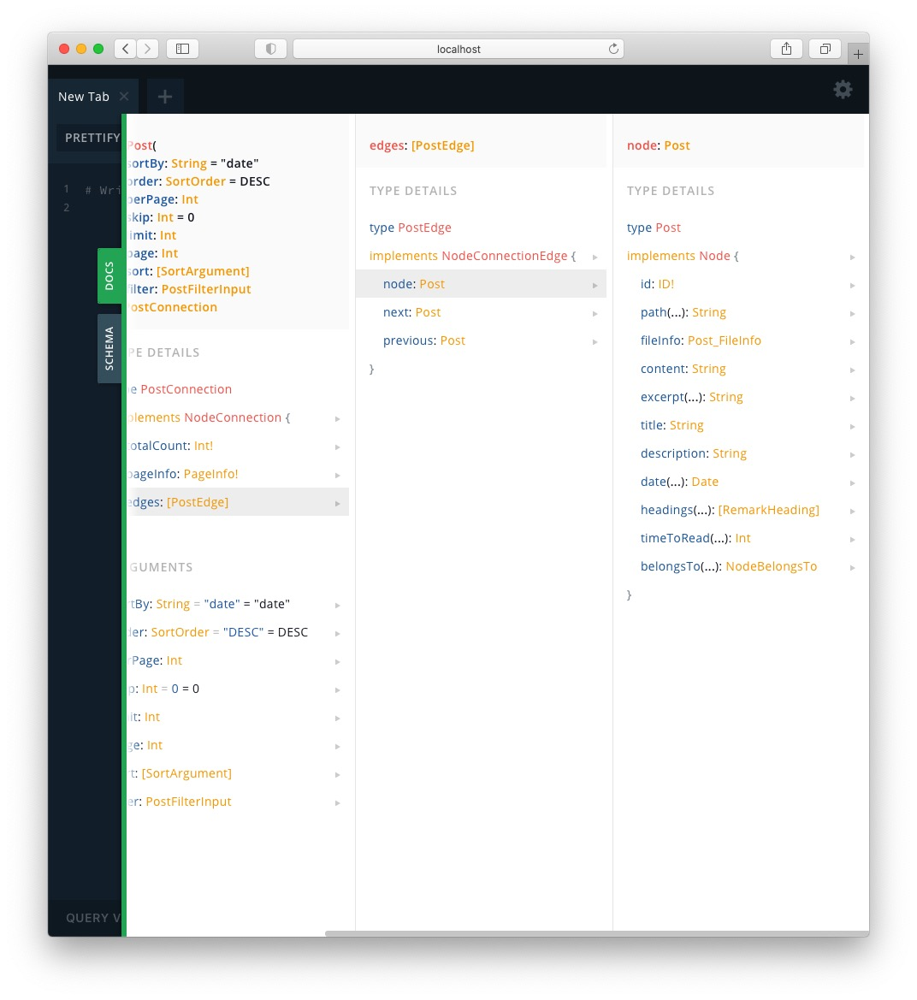
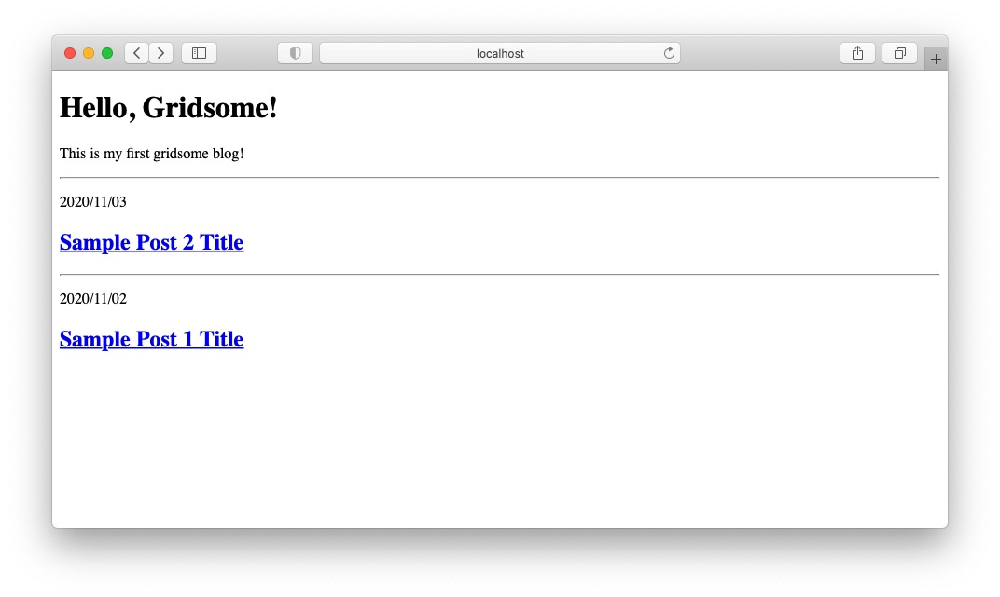
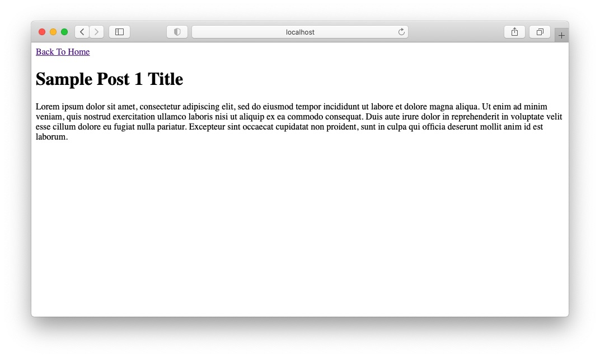

## Gridsomeとはなにか

ざっくりいうと**Vue.js版のGatsby**です。

Vue.jsのフレームワークonフレームワークで、JAMStack(JavaScript+APIs+Markup)です。

ようするに、ReactベースのこのブログのVue.jsベース版を試しに作ってみようという試みです。

## Gridsomeのインストール

とりあえずローカルホストで立ち上がるところまで確認してみましょう。

```bash
$ npx gridsome create gridsome-thanaism
$ cd gridsome-thanaism
$ npm i @gridsome/cli
$ npx gridsome develop
```

難なくウェルカムページを拝むことができました。


## Markdown形式への対応

素のjsの状態ではMarkdownは扱えないため、GatsbyでいうRemarkプラグイン的なものを導入する必要があります。

- `@gridsome/source-filesystem`
- `@gridsome/vue-remark`

上記のどちらかを使えばいいっぽいです。両方ともGridsomeのプラグインとして提供されています。  
主な違いとしては`vue-remark`のほうはMarkdownにVue.jsのコンポーネントを組み込めるようです。

が、記事の可搬性を考えたときにプラットフォームへの依存性はあまり強めたくないので、今回は`source-filesystem`を使うことにしました。

```bash
$ npm i @gridsome/source-filesystem
```

Gatsbyと同様にプラグインを入れたらGridsomeに使っていることを教えるために設定を書き換える必要があります。  
以下のように`gridsome.config.js`を書き換えればよいです。

```js
module.exports = {
  siteName: 'Gridsome',
  plugins: [
    {
      use: '@gridsome/source-filesystem',
      options: {
        path: 'content/posts/**/*.md',
        typeName: 'Post',
      },
    },
  ],
};
```

## TypeScript の導入

Gridsomeはデフォルトだとjsです。何はともあれTypeScriptを使いたいので導入します。

公式だとyarnが推奨されていますが、npmを理解しないうちにyarnを使っちゃ**やーん**ということでnpmでインストールします。あっ、まって。ブラウザバックしないで。

```bash
$ npm i --save-dev typescript ts-loader gridsome-plugin-typescript
```

プラグインを入れたので、再度`gridsome.config.js`を書き換えます。  
以下を追記します。

```js
plugins: [
  {
    use: 'gridsome-plugin-typescript',
  },
];
```

続いて、`tsconfig.json`をプロジェクトフォルダ直下に追加します。

```json
{
  "compilerOptions": {
    "target": "es5",
    "module": "es2015",
    "moduleResolution": "node",
    "noImplicitReturns": true,
    "outDir": "./built/",
    "sourceMap": true,
    "strict": true
  },
  "include": ["./src/**/*"]
}
```

最後に、`vue-shims.d.ts`ファイルを`src`フォルダ直下に追加します。  
`.vue`ファイルを TypeScript に読み込ませるためのものです。

```ts
declare module '*.vue' {
  import Vue from 'vue';
  export default Vue;
}
```

ここまでくればGridsomeでTypeScriptが使用できるはずです。
満を持してコンポーネントの`<script>`タグを`<script lang="ts">`に置き換えてしまいましょう。

`$ npx gridsome develop`して、ちゃんと立ち上がることを確認しておきます。

## Vue.jsの基本

そもそもGridsomeの前にVue.jsの使い方がよく分かっていないので、サクッとさらっていきます。

とりあえず、`gridsome create`で自動で作成された各ディレクトリに`README.md`があるので読んでみます。

### ディレクトリ構成

ディレクトリ構成はこんな感じです。  
`src`配下のフォルダをいろいろ書き換えていく感じでしょうね。

```
.
├── src
│   ├── components
│   │   └── README.md
│   ├── layouts
│   │   ├── Default.vue
│   │   └── README.md
│   ├── pages
│   │   ├── About.vue
│   │   ├── Index.vue
│   │   └── README.md
│   ├── templates
│   │   └── README.md
│   ├── favicon.png
│   ├── main.js
│   └── vue-shims.d.ts
├── static
│   └── README.md
├── gridsome.config.js
├── gridsome.server.js
├── package-lock.json
├── package.json
├── README.md
└── tsconfig.json
```

### src/components

> Add components that will be imported to Pages and Layouts to this folder.

`Pages`や`Layouts`に組み込むための再利用可能なコンポーネントをここに置くっぽい。

### src/layouts

> Layout components are used to wrap pages and templates. Layouts should contain components like headers, footers or sidebars that will be used across the site.

サイト全体のデザインで共通するヘッダーやフッター、メニューバー等々のコンポーネントを含むページ構成をここで定義するっぽい。

### src/pages

> Pages are usually used for normal pages or for listing items from a GraphQL collection.

単一ページや、GraphQLで取得されるデータ（たとえばブログの各記事）のリスト表示用のページに使われるっぽい。

### src/templates

> Templates for **GraphQL collections** should be added here.
> To create a template for a collection called `WordPressPost`
> create a file named `WordPressPost.vue` in this folder.

GraphQLのコレクション名と同じ名前の`.vue`ファイルを作れと書いてありますね。  
今回は`Post.vue`とかを作ればいいっぽいです。

### static

> Add static files here. Files in this directory will be copied directly to `dist` folder during build. For example, /static/robots.txt will be located at [https://yoursite.com/robots.txt](https://yoursite.com/robots.txt).

ファイルそのものにURLを割り当てたい場合このフォルダにぶちこめばいいっぽいです。  
今回はあまり関係なさそうですね。

## vue コンポーネントの構成

とりあえず、各フォルダにどんな感じの役割のものを入れていくかザックリ理解しました。  
合っているかわかりませんが、こんな感じな気がします。

- 各記事の閲覧ページ
  `src/templates/Post.vue` => 枠 + 内容はクエリ
- 記事の一覧表示
  `src/pages/Index.vue` => 枠 + 内容はクエリ
- 記事一覧のカード
  `src/components/PostCard.vue` => 書式はこっちで作る
- About ページ
  `src/pages/About.vue` => 枠 + 内容はベタ書き
- ヘッダーとか
  `src/layouts/Default.vue` => 各ページのWrapperとして使える？

### Default.vue でレイアウトを定義する

まずは、Wrapperになっているっぽいレイアウトの中身から見ていきましょう。

```ts
<template>
  <div class="layout">
    <header class="header">
      <strong>
        <g-link to="/">{{ $static.metadata.siteName }}</g-link>
      </strong>
      <nav class="nav">
        <g-link class="nav__link" to="/">Home</g-link>
        <g-link class="nav__link" to="/about/">About</g-link>
      </nav>
    </header>
    <slot />
  </div>
</template>

<static-query>
query {
  metadata {
    siteName
  }
}
</static-query>

<style>
/* スタイル定義は割愛 */
</style>
```

見た感じ`template`の部分がReactで`return`しているJSX(TSX)に相当する部分ですね。

`<g-link>`という見慣れないタグがありますが、どうやらGridsome特有のタグのようです。  
Reactの`<Router>`とか`<Link>`みたいな感じですかね。サイト内リンクを貼るときはこれを使うんでしょう。

あと、オリジナルのVueだと`<router-link>`というタグを使うらしいです。  
このあたりは書き方の違いだけですね。

あとは`<slot/>`とかいうのがいます。これがおそらくラップする対象のコンポーネントが入る場所だろうと思います。

また、`main.js`を見てみると、こんな記述があります。

```js
import DefaultLayout from '~/layouts/Default.vue'
...
Vue.component('Layout', DefaultLayout)
```

ここで`<Layout>`タグをラッパーとして設定しているようです。
ということで、追加のレイアウトを使いたかったら`main.js`で同じように定義してあげればよさそうですね。

## `main.js`を`main.ts`にする

せっかく触れたのでここをTypeScriptにしてしまいましょう。  
単純にリネームだけすると型が指定されていないとクソほど怒られるので、型定義をしてあげます。

そりゃTypeScriptなんだから型は定義しないといけません。

```ts
import DefaultLayout from '~/layouts/Default.vue';
import { VueConstructor } from 'vue';
import VueRouter from 'vue-router';
import { MetaInfo } from 'vue-meta';

interface VueContext {
  router: VueRouter;
  head: MetaInfo;
  isClient: boolean;
}

export default function (Vue: VueConstructor, { router, head, isClient }: VueContext) {
  // Set default layout as a global component
  Vue.component('Layout', DefaultLayout);
}
```

正直、この型で合っているのかよくわかっていませんが、とりあえず動くのでいったんこれでやり過ごします。  
`isClient`とか調べもせず変数名から勝手に`boolean`にしてしまいました。今は必要なさそうなのであとで調べておきます……。

## `index.vue`ページに投稿一覧を組み込む

ブログなので、トップに記事一覧を並べてみましょう。  
まず、いらないところはすべて省いて作ってみます。徹底的に削ぎ落とさないと**どこがクリティカルか**というのがわからないマンになってしまいますので。

ということで`src/pages/Index.vue`を順番に構成していきましょう。

### GraphQLクエリについて

まずは、`<template>`タグの中身を書いていく前に、GraphQLのクエリを設定していきましょう。

```tsx
<page-query>
query {
  allPost {
    totalCount
    edges {
      node {
        title
        date (format: "YYYY/MM/DD")
        path
      }
    }
  }
}
</page-query>
```

さっき入れた`@gridsome/source-filesystem`がmarkdownを勝手にGraphQLで引っ張れるようにしてくれているのでそれを使っています。  
いろいろ引っ張ってこれるものはありますが、とりあえずタイトル`title`と投稿日時`date`、あとはリンクを貼るのに必要なファイルパス`path`だけ取得しました。

たとえば他に取得できるものとしては`timeToRead`や`id`などいろいろあります。  
今回はGridsomeメインなのでGraphQLの説明は省きますが、いろいろ試したければGraphQLのplaygroudを使うのがよいでしょう。

`npx gridsome develop`したら案内される

```bash
Explore GraphQL data at: http://localhost:8080/___explore
```

にいけばplaygroundにつながるので、`DOCS`で見ればよいでしょう。



### `<template>`タグの中身

```tsx
<template>
  <Layout>
    <h1>Hello, Gridsome!</h1>
    <p>This is my first gridsome blog!</p>
    <PostCard v-for="edge in $page.allPost.edges" :key="edge.node.id" :post="edge.node" />
  </Layout>
</template>
```

とりあえず、さきほど見た`<Layout>`タグでラップしたあと、`<PostCard>`タグを使ってGraphQLで取得した全投稿を`v-for`文でループします。

どうやらVue.jsではHTMLタグにattributeを付与したいときは、`:key=`のように先頭に':'を付けるようです。

つまり、ここでやっているのは、`edge in $page.allPost.edges`は`page-query`で取得した`allPost`の`edges`コレクションをForeachで回して、各`edge`に対して`edge.node.id`だとか`edge.node`を取得してattributeとして設定している、ということになります。

なるほど、という感じですね。

で、いきなり出てきた`<PostCard>`タグですが、これは未定義で勝手に使っているので、のちのち定義してあげます。

### `<script>`タグの中身

とりあえず、まだ作ってない`PostCard`コンポーネントを読み込む処理だけ作っておきましょう。

TypeScriptで書くためには、`export default Vue.extend()`しておけばよいようです。  
あと、モジュールをインポートするときには`.vue`拡張子をつけてあげてください。

```ts
<script lang='ts'>
import Vue from "vue";
import PostCard from "@/components/PostCard.vue";
export default Vue.extend({
  components: {
    PostCard
  }
})
</script>
```

## `PostCard`コンポーネントをつくる

続いては、未定義の`src/components/PostCard.vue`コンポーネントを作っていきます。

```tsx
<template>
  <div>
    <hr>
    <p v-html="post.date"/>
    <g-link :to="post.path">
      <h2 v-html="post.title"/>
    </g-link>
  </div>
</template>

<script lang="ts">
import Vue from "vue";
export default Vue.extend({
  props: ["post"]
});
</script>
```

`<script>`の中では、親コンポーネントである`Index.vue`から受け取る`post`を`props`で定義します。

あと、Vue.jsもReactと同じように`<template>`の中身は単一のHTMLElementとして渡す必要があるようなので`div`でラップしています。  
単なるカードなので`props`での値の受け渡し以外は特筆すべきことはあまりありません。

また、変数を用いたリンク先を指定するときは、`g-link`の中身に`to=`ではなく`:to=`を使用します。

## `Post`テンプレートを作る

それでは最後に投稿の内容を表示する`src/templates/Post.vue`テンプレートを作っていきましょう。  
さきほどの`PostCard`コンポーネントにあった`<g-link :to="post.path">`の行き先ですね。

テンプレートはGraphQLのコレクションと同じ名称を使用します。  
中身としては`Index.vue`で使ったのとほぼ同じ内容で構成することができます。

```tsx
<template>
  <Layout>
    <g-link to="/" class="link">Back To Home</g-link>
    <h1>{{$page.post.title}}</h1>
    <p v-html="$page.post.content" />
  </Layout>
</template>

<page-query>
query Post ($path: String!) {
  post: post (path: $path) {
    title
    content
  }
}
</page-query>
```

ここで、`query Post($path: String!)`というように引数を受け取っていますが、`$id: ID`などとしても同様に受け取ることができます。  
詳しくは[公式の情報](https://gridsome.org/docs/templates/#add-data-to-a-template)を参考にしてください。

## 記事を投稿する

ここまでくればあとは記事を投稿してみましょう。

```md
---
title: 'Sample Post 1 Title'
description: 'Sample post 1 description'
date: 2020-11-02
---

Lorem ipsum ...
```

記事のプロパティはGatsby同様にyaml形式で記述すればよいのでGraphQLを統一してあげればGatsbyとGridsome間で記事を自由に移動できますね。

## トップページの状態

とりあえず、本当に最低限の構成でGridsomeでブログを構築しました。  
実際に運営するのであればシンタックスハイライトだとかを含めたスタイルをしっかり当てていく必要がありますが、今回は Gridsome の構成を知るのが目的なのでスタイルは意図的に削除しています。

なにがどこにリンクしているかはもう分かっているので、あとは足したい項目を付け加えていけばOKです。  
あと、`Default.vue`からヘッダーも削除しています。



## 各投稿の状態

同様に各記事がどう表示されているかのサンプルです。  
ちゃんとやるなら`Back To Home`とかも個別のレイアウトにして`main.ts`で定義してやったりするのかな、という感じ。



## おわりに

とりあえずこれでGridsomeの導入編は終了です。  
ここまでやっておいてなんですが、Vue.jsの勉強という意味ではNuxt.jsとかでちゃんとアプリケーションを作らないといけないかな、と感じました。

スタイルを整えたりGatsbyの再生産をするのも面倒なので、Gridsomeはデプロイはせずに、しばらくはGatsbyでやろうと思います。
