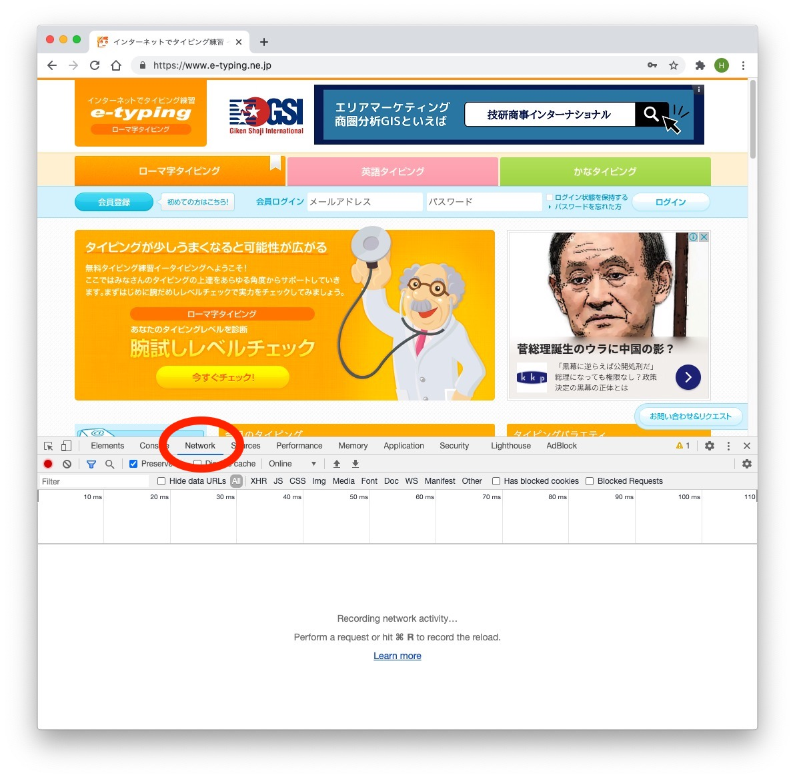
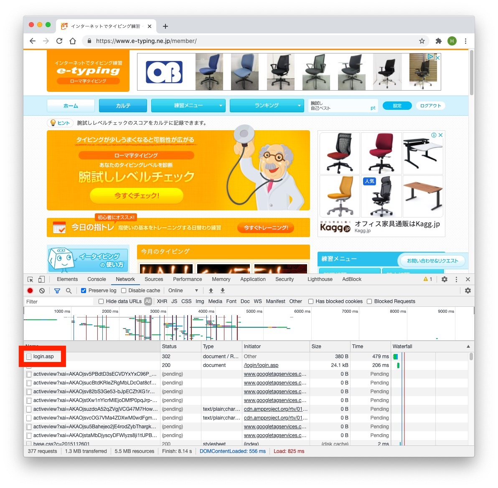
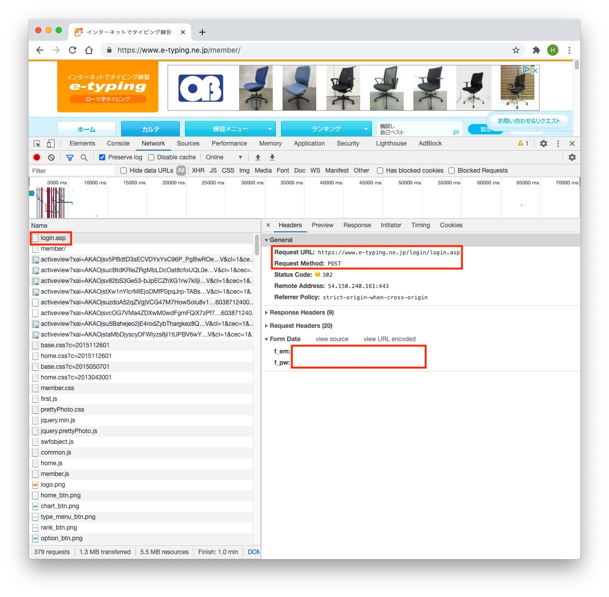

## VBA でスクレイピングするという需要

正直、**スクレイピングするなら Python 使ってください、終了〜**。

と言いたいところですが、非 IT 系のサラリーマンが社内で自由に利用できるツールって VBA くらいしかないんですよね。  
つまり多少は需要ありそうだと思ったのでごく簡単に紹介します。

この記事の想定読者は、ノンプロ VBAer です。
その層だと基本的に VBA から逸れた範囲のベース知識はそこまでないと思うので、読む人によっては退屈かもしれませんが基礎的な内容も軽く触れます。

## VBA スクレイピングには大きく分けて 2 つ

VBA でスクレイピングする方法はざっくり 2 通りに分かれます。

- IE 操作系
- HTTP リクエスト系

IE 操作系に関しては、以前に[ビギナー向け記事](https://thanaism.com/archives/386)を書いたのでそっちを参照してください。

今回は、HTTP リクエストでログイン処理を突破することを目標にしましょう。

## HTTP リクエストとは

初心者向けのざっくり説明なので多少の誤謬は目を瞑ってください。  
詳しいことが知りたい人は W3C とか MDN とか勝手に見てくれ。

HTTP リクエストってのは、HTTP っていう通信上の決まりごと（プロトコルというやつ）に沿った形式で、サーバーに対して「この情報をくれ」と要求を送信することです。  
つまり、普段ブラウザが代わりにやってくれてることをブラウザを使わずにやるって考えればいいです。

ブラウザがやることの代わりをするならブラウザでやればいいじゃん、という感じですが、そうしないのはいくつか理由があります。

- ブラウザの仕事はリクエストを投げるだけではない
- たとえば受け取ったデータを画面に描画する処理がある
- 画面描画は重いので必要ないなら省きたい（高速化）
- IE がオワコン（すでにサポート外のサイトが多い）

まとめると、**オワコンの IE なんざ使いたくないし高速にデータ取得したい**からリクエスト形式でスクレイピングするんですね。

## e-Typing でログインしてみよう

とりあえず有名タイピング練習サイトの[e-Typing](https://www.e-typing.ne.jp/)さんがあんまり小難しいこと考えずに突破できるシンプルなログイン仕様なので、試しにリクエスト方式でログインしましょう。

### Http リクエストを管理するクラスモジュール

超適当にクラスモジュールを作ったので、とりあえずはコピペして使いましょう。  
エラー処理とか記事に関係ない部分は削除しているので、あくまでチュートリアル用です。
詳細は気が向いたら解説します。

```vb
Rem Http.cls
Option Explicit

Private HttpObj As Object
Private Declare Sub Sleep Lib "kernel32" (ByVal ms As Long)

Private Sub Class_Initialize()
Rem コメント部は切り替え用。分からないうちは切り替えずに使いましょう。
    Set HttpObj = CreateObject("Msxml2.ServerXMLHTTP.6.0")
    'Set HttpObj = CreateObject("MSXML2.XMLHTTP")
    'Set HttpObj = CreateObject("WinHttp.WinHttpRequest.5.1")
End Sub

Private Sub Class_Terminate()
    Set HttpObj = Nothing
End Sub

Public Function Send(url, Optional IsPOST As Boolean = False, Optional data = vbEmpty) As Boolean
On Error GoTo HasErr
    Sleep 2000 'スクレイピングのマナー(1000以上を設定のこと)
    With HttpObj
        .Open IIf(IsPOST, "POST", "GET"), url, False
        .setRequestHeader "Content-Type", "application/x-www-form-urlencoded"
        .setRequestHeader "Connection", "Keep-Alive"
        .setRequestHeader "Accept-encoding", "identity"
        .setRequestHeader "User-Agent", "Mozilla/5.0 (Windows NT 10.0; Win64; x64) AppleWebKit/537.36 (KHTML, like Gecko) Chrome/84.0.4147.135 Safari/537.36"
        .Send data
        DoEvents
        If .Status <> 200 Then GoTo HasErr
    End With
    Send = True
    Exit Function
HasErr:
    Send = False
End Function

Public Sub openHtmlOnBrowser(Optional Charset As String = "UTF-8")
    Dim Filename As String
    Filename = CreateObject("WScript.Shell").SpecialFolders("Desktop") & Chr(92) & "tmp_" & Format(Now, "HHMMSS") & ".html"
    With CreateObject("ADODB.Stream")
        .Charset = Charset
        .Open
        .WriteText HttpObj.responseText, 1
        .SaveToFile Filename, 2
        .Close
    End With
    Dim cmd As String: cmd = "explorer " & Chr(34) & Filename & Chr(34)
    CreateObject("WScript.Shell").Run cmd
    If MsgBox("Delete file?", vbYesNo + vbQuestion) = vbYes Then
        CreateObject("Scripting.FileSystemObject").DeleteFile Filename
    End If
End Sub
```

軽く説明すると、`Send`で`GET`リクエストが送れます。オプショナル引数を指定すると`POST`リクエストも送れます。

**「`GET`とか`POST`ってなによ」**って思うかもしれませんが、あとで説明するので、今はそういうのがあるんだと思えば OK です。

`openHtmlOnBrowser`は、デバッグ用です。  
サーバーから返ってきたレスポンスをブラウザ上で確認したい場面で使います（あ〜！なんて親切なプロシージャ！）。  
たまに文字コードが`UTF-8`じゃない終わってるサイトがあるので、そういうときは`Charset`を指定してあげてください。

### なにはともあれログイン

とりあえず、e-Typing にログインしましょう。
このコードでいけるはず。

```vb
Option Explicit

Sub test()
    Dim Http As Http: Set Http = New Http

    Rem トップページにアクセス
    Http.Send ("https://www.e-typing.ne.jp/")
    Http.openHtmlOnBrowser

    Rem POSTデータの設定
    Dim UserName, Password
    UserName = "自分のメールアドレスを入れる"
    Password = "自分のパスワードを入れる"
    Dim data As String
    data = "f_em=" & UserName & "&f_pw=" & Password

    Rem ログイン処理
    Call Http.Send("https://www.e-typing.ne.jp/login/login.asp", True, data)
    Http.openHtmlOnBrowser
End Sub
```

### POST データの設定について

はい、じゃあそろそろリクエストについて少し説明します。

スクレイピングではとりあえず`GET`と`POST`という 2 種類のリクエストをおさえれば OK です。

- `GET`：URL でリクエスト
- `POST`：URL とデータでリクエスト

基本的に、URL だけあればアクセスできるページはだいたい`GET`リクエストです。  
今回のログインのように URL に加えて欲しいデータの特定のために ID とかパスワードが必要な場合に`POST`が使われることが多いです。

ちなみに、データを送るケースであってもパスワードのように隠蔽しなくてもよい情報であれば、GET リクエストに`クエリ`を付与してリクエストするという方法もあります（わりと重要ですが、今回は割愛します）。

### 具体的な調べ方

とはいえ、そんなことを言われてもどうリクエストをすればいいかまだ判然としないと思います。

でも、安心して OK です！Chrome の開発者ツールを使用すれば、対象の操作が`GET`なのか`POST`なのかなどを含め要件を調べることができます。

開発者ツールの`Network`タブを開いた状態でログインしてください。



ログインするとブワァっといろいろ流れますが、一番上の`login.asp`を調べてみましょう。



はい、それっぽいのが出てきましたね。`Request Method`と`Form Data`にしたがって、コードを実装しましょう。形式は、上のコードを参考にすればなんとなくわかるかと思います。



## おわりに

今回はめちゃくちゃ簡単に解説しましたが、実際には`Form Data`に ID とパスワードだけじゃなくて色々ごちゃごちゃ入ってるサイトがほとんどです。

そうした値をどう取得してくるかというのは、`JavaScript`だとか`HTML`の知識が必要になるのでまた需要がありそうだったら書こうと思います。

とりあえず、今回はさわりだけ。いろいろ自分でいじくって試してみてください。  
それではお疲れさまでした。
