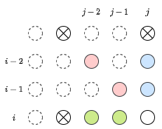

## 累積和で添字がいつもわからなくなる

とりあえず、解説ACしたものの同様の問題が本番で出ても添字をバグり散らかす自信があるので、対策を考えたい。

## 解説ACコード

```py
h,w=map(int,input().split())
s=[input() for _ in range(h)]
MOD=10**9+7

# DP table(1-index)
dp=[[0]*(w+1) for _ in range(h+1)]
# cum sum
bot=[[0]*(w+1) for _ in range(h+1)]
rig=[[0]*(w+1) for _ in range(h+1)]
bor=[[0]*(w+1) for _ in range(h+1)]

# cum sum: 0 to (N-1) => 0 to N
for i in range(1,h+1):
  for j in range(1,w+1):
    # start position is 1
    if i==j==1: dp[i][j]=1
    # add cumsum to dp table each dir
    dp[i][j]+=(bot[i-1][j])%MOD
    dp[i][j]+=(rig[i][j-1])%MOD
    dp[i][j]+=(bor[i-1][j-1])%MOD
    # can get new cumsum from current new dp
    bot[i][j]+=dp[i][j]+bot[i-1][j]
    rig[i][j]+=dp[i][j]+rig[i][j-1]
    bor[i][j]+=dp[i][j]+bor[i-1][j-1]
    # reset value to 0 at wall position
    if s[i-1][j-1]=='#':
      dp[i][j]=0
      bot[i][j]=0
      rig[i][j]=0
      bor[i][j]=0
    # get MOD
    dp[i][j]%=MODs

# output
print(dp[h][w])
```

## 図解

下図の$(i,j)$にクイーンが至る経路を考える。バツ印は壁を表している。



クイーンは直線的にしか移動できないため、方向別に青・赤・緑のいずれかの位置から移動してくることになる。

これを公式解説と同様のDP式で表せば、以下となる。

$$
\begin{aligned}
dp[i][j]&=dp[i-1][j]+dp[i-2][j]\\
&+dp[i][j-1]+dp[i][j-2]\\
&+dp[i-1][j-1]+dp[i-2][j-2]
\end{aligned}
$$

これを一般化して表記すれば、右辺を以下の3項にまとめることができる。

$$
\begin{aligned}
dp[i][j]&=\sum_{k=1}{dp[i-k][j]}\\
&+\sum_{k=1}{dp[i][j-k]}\\
&+\sum_{k=1}{dp[i-k][j-k]}
\end{aligned}
$$

### 最初に壁がないケースを考える

壁がないケースを考えれば、先ほどの式の右辺各項は累積和の形をしている。  
代表として縦方向、すなわち`bottom`に向かう累積和`cum_bot`を考えてみよう。

ここで、$cum_{bot}[i][j]$の添字をどう置くかがバグり散らかしポイントだ。  
試しにマス$(i,j)$の値を**含む**累積和として書いてみる。

$$
\begin{aligned}
cum_{bot}[i][j]&=\sum_{k=1}{dp[i-k][j]}\\
&=cum_{bot}[i-1][j]+dp[i][j]
\end{aligned}
$$

この形は、先ほどの解説ACに準拠した添字の取り方である。

### 区間和を求める場合は半開半閉区間が基本

通常、累積和を扱う場合は区間和を求めたい場合が多い。そうしたときは半開半閉区間で

$$
cum[a,b)=cum[0,b)-cum[0,a)
$$

というように持つのが整合性が取れていて便利だ。

すなわち要素数$N$の配列$[0,N-1)$に対して、要素数$N+1$の累積和$[0,N)$を考える必要がある。

また、このとき区間$[0,0)$の値は$0$である。

### 本問題に同じ考えを適用する

0インデックスと1インデックスが入り交じると頭がバグり散らかして死んでしまうため、どのような問題を解く場合でも必ず0インデックスで考えることにしたい。

このとき、$dp[i][j]$はマス$(i,j)$に至る経路数とおこう。インデックスの変動によるDP式の変化はない。問題は累積和との整合性の部分である。

累積和の配列サイズは元となる配列の要素数$N$に対して$N+1$であるので、先ほどとは異なり$cum[i][j]$はマス$(i,j)$を**含まない**ように取るのがセオリーと言えるだろう。

すなわち、`bottom: bot, right: rig, bottom-right: bor`として、以下のように書ける。

$$
dp[i][j]=cum_{bot}[i][j]+cum_{rig}[i][j]+cum_{bor}[i][j]
$$

そして、$dp[i][j]$が求まったときに新たに求める累積和は以下のようになる。

$$
cum_{bot}[i+1][j]=dp[i][j]+cum_{bot}[i][j]\\
cum_{rig}[i][j+1]=dp[i][j]+cum_{rig}[i][j]\\
cum_{bor}[i+1][j+1]=dp[i][j]+cum_{bor}[i][j]\\
$$

## 添字をセオリー通りにして解き直したコード

```py
h,w=map(int,input().split())
s=[input() for _ in range(h)]
MOD=10**9+7

# DP table[0,N)
dp=[[0]*w for _ in range(h)]

# cumsum[0,N+1)
bot=[[0]*(w+1) for _ in range(h+1)]
rig=[[0]*(w+1) for _ in range(h+1)]
bor=[[0]*(w+1) for _ in range(h+1)]

# start position is 1
dp[0][0]=1

for i in range(h):
  for j in range(w):
    # add cumsum to dp table each dir
    dp[i][j]+=bot[i][j]%MOD
    dp[i][j]+=rig[i][j]%MOD
    dp[i][j]+=bor[i][j]%MOD
    # get MOD
    dp[i][j]%=MOD
    # now can get new cumsum from current new dp
    bot[i+1][j]+=dp[i][j]+bot[i][j]
    rig[i][j+1]+=dp[i][j]+rig[i][j]
    bor[i+1][j+1]+=dp[i][j]+bor[i][j]
    # reset value at next to wall position
    if s[i][j]=='#':
      dp[i][j]=0
      bot[i+1][j]=0
      rig[i][j+1]=0
      bor[i+1][j+1]=0

# output
print(dp[h-1][w-1])
```

これでようやく、セオリー通りのインデックスで頭とコードを整理することができた。

こうやって配るDPで書いて、かつ配列外参照を`if`文に頼らずやるというのは、いざ本番で書くと本当にバグり散らかしてしまうので練習あるのみだろう。
