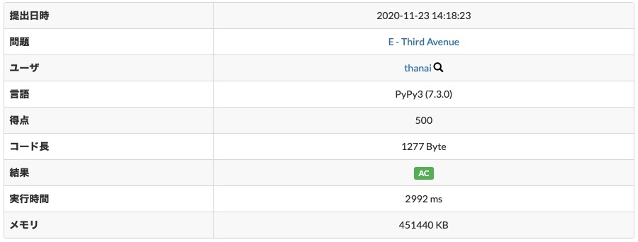

## TLE地獄に苦しんだので高速化したい

CでWAしまくって、Dはパット見わからなかったので、Eに挑戦しました。  
あざやかにTLEして2完で爆死しましたので反省の意を込めてどう改善できるか考察します。

<blockquote class="twitter-tweet"><p lang="ja" dir="ltr">今回のABC、実質3分の戦いでした。さようなら。 <a href="https://t.co/30rtcKWTPW">pic.twitter.com/30rtcKWTPW</a></p>&mdash; タナイ (@okinawa__noodle) <a href="https://twitter.com/okinawa__noodle/status/1330508579560943617?ref_src=twsrc%5Etfw">November 22, 2020</a></blockquote>

## 解説ACコード

```py
h,w=map(int,input().split())
# 盤面入力
grid=[]
for _ in range(h):
    grid.append(list(input()))
# ワープ位置の保持
warp=[[] for _ in range(26)]
# 開始・終了・テレポート位置記録
for i in range(h):
    for j in range(w):
        p=grid[i][j]
        if p=='S':
            si,sj=i,j
        elif p=='G':
            gi,gj=i,j
        elif p.islower():
            warp[ord(p)-97].append([i,j])
# BFS用キュー
from collections import deque
que=deque()
que.append([si,sj])
# 最短距離の保持
INF=1<<30
cost=[[INF]*w for _ in range(h)]
cost[si][sj]=0
# ワープ済の保持
warped=[False]*26
# 周囲4マス
di=[-1,0,1,0]
dj=[0,1,0,-1]
# BFS
while que:
    i,j=que.popleft()
    c=cost[i][j]
    o=ord(grid[i][j])-97
    # 未使用のワープ地点ならキューに加える
    if grid[i][j].islower() and warped[o]==False:
        warped[o]=True
        for n,m in warp[o]:
            if cost[n][m]>c+1:
                que.append([n,m])
                cost[n][m]=c+1
    # 通常の周囲4マスのBFS
    for k in range(4):
        ni=i+di[k]
        nj=j+dj[k]
        if ni<0 or ni>=h:continue
        if nj<0 or nj>=w:continue
        if grid[ni][nj]=='#':continue
        if cost[ni][nj]>c+1:
            que.append([ni,nj])
            cost[ni][nj]=c+1
# 未到達なら不可能
if cost[gi][gj]==INF:
    cost[gi][gj]=-1
# 出力
print(cost[gi][gj])
```

[上記のコード](https://atcoder.jp/contests/abc184/submissions/18362614)で`2992 ms`というTLE超ギリギリの状態。
ちなみに周囲4マスの`append`をワープより先にやるとTLEする（なぜかはわからない）。



## 配列外参照の場合分けをなくす

とりあえず定数倍高速化のために周囲に壁を張って配列外参照を防ぐ`if`文をなくして提出してみます。

なにが変わるかといえば、下記でコメントアウトしているif文をなくせます。

```py
for k in range(4):
    ni=i+di[k]
    nj=j+dj[k]
    # if ni<0 or ni>=h:continue
    # if nj<0 or nj>=w:continue
    if grid[ni][nj]=='#':continue
    if cost[ni][nj]>c+1:
        que.append([ni,nj])
        cost[ni][nj]=c+1
```

### 結果は……

[まさかの`1543 ms`でした。](https://atcoder.jp/contests/abc184/submissions/18363587)

**エッ……？！**

この記事もう終わりじゃんって勢いですが、これ効くんですね。  
 よく見かける実装だったので不思議に思ってましたがなるほど。

ちなみに入力周りはこんな感じです。

```py
# 盤面入力
grid=['#'*(w+2)]
for _ in range(h):
   grid.append('#'+input()+'#')
grid.append('#'*(w+2))
# 位置記録
for i in range(1,h+1):
   for j in range(1,w+1):
     ...
```

いや、ちょっと待ちましょう。  
元のコードでは、`grid.append(list(input()))`していました。

もしかして、2次元配列として持つのが遅いんでしょうか。  
なんか、こっちの影響のほうが明らかにデカそうです。

### `append(list(input()))`を`append(input())`にする

はい。[`1783ms`でした。](https://atcoder.jp/contests/abc184/submissions/18363747)  
どう考えてもこっちの影響でしたね。

pythonだと文字列に対して、`s[4]='h'`みたいな書き換えができないので配列化していたんですが、この速度差は顕著すぎますね。

コスト記録用の配列は別に持つという方針が今後は良さそうです。

### 記録用配列を1次元配列化する

2次元配列がどれくらい遅さに効いているのかも気になったので、書き換えて試してみます。
コスト記録用の配列である`cost[h][w]`を`cost[h*w]`に変更しましょう。

結果は、[`1532 ms`でした。](https://atcoder.jp/contests/abc184/submissions/18363972)  
劇的には高速化しませんが、ある程度の効果はありそうです。

## おわりに

実行時間順に並べて見るとさらに一桁速いオーダーのコードがあるんですが、まだその部分のクリティカルな工夫は把握できていません。

とりあえず、入力の`split`はそれなりに時間を要すことがわかったので今後よくよく気をつけていきたいと思います。
