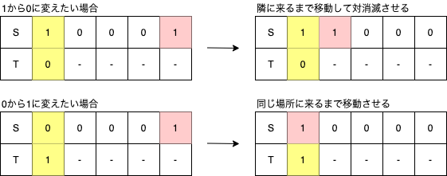

## 結果

Ratedではないのでレート変動はありませんが、0完です。
一応、AとBのサンプルまでは通したので 600 点でも問題文の理解と愚直解の実装は出来るようになっています。

ただ、計算量を落とす方法は思い付けませんでした。  
参加も1時間遅れ、しばらく考察・実装してみるも「もうこれは0完だ」と悟り、挙句の果てにコンテスト中に飲酒し始めるという有様でした。

## これまでやったこと

- AOJのITP1をC++で完走した
- paizaのD問題をPythonで162問ぜんぶ埋めた
- paizaでSランクを取得した
- 蟻本の初級編をある程度理解した
- 蟻本の中級編に目を通した
- AtCoder ProblemsでEasyとMediumをちょこちょこPythonでやった
- 「[コーディングを支える技術](https://amzn.to/2GEO9qr)」を読んだ

## これまでの成績

AGCはやっぱり天才御用達コンテストでした。無念。

| No. | contest  |      A       |      B       |      C       |      D       |     E     | prf  |
| :-: | :------: | :----------: | :----------: | :----------: | :----------: | :-------: | :--: |
|  -  |  AGC049  |     (1)      |     (4)      |      -       |      -       |     -     |  -   |
| 12  |  ABC182  |   **0:59**   |   **7:16**   | **21:16**(1) |  **32:27**   | **84:07** | 1235 |
| 11  |  ABC181  |   **0:48**   |   **5:38**   |  **23:44**   | **58:56**(4) |     -     | 881  |
| 10  |  ARC106  | **13:12**(1) | **62:56**(2) |      -       |      -       |     -     | 914  |
|  9  |  ARC105  | **20:20**(4) |  **40:16**   |      -       |     (1)      |     -     | 600  |
|  8  | HHKB2020 |   **2:31**   | **20:16**(1) | **43:36**(3) |      -       |     -     | 543  |
|  7  |  ARC104  |   **7:01**   | **64:30**(1) |      -       |      -       |     -     | 650  |
|  6  |  ABC179  |  **18:32**   |  **25:31**   |      -       |      -       |     -     | 122  |
|  5  |  ABC178  |   **2:56**   |   **5:56**   |      -       |      -       |     -     | 508  |
|  4  |  ABC177  |   **2:32**   | **14:10**(2) |     (3)      |      -       |     -     | 332  |
|  3  |  ABC176  |   **9:09**   |  **13:26**   |  **20:32**   |      -       |     -     | 550  |
|  2  |  ABC175  |  **10:46**   |  **39:48**   | **91:49**(3) |      -       |     -     | 543  |
|  -  |  AGC047  |     (1)      |     (1)      |      -       |      -       |     -     |  -   |
|  1  |  ABC174  |  **57:25**   |  **53:51**   |     (3)      |      -       |     -     |  79  |

## A問題

かなりレートが高い層でも解けない人が多く出た問題みたいです。  
一方で期待値問題が得意な人たちは「これは典型、200点でもよいのでは」というテンションだったので、自分もちゃんと復習して期待値の典型を抑えておくべきかと感じました。

まあ、青Diffなので解けなくてもまあ妥当といえば妥当ですね。

## 提出コード

```py
n=int(input())
s=[]
for _ in range(n):
  s.append(input())
memo=[]

def remove(d,i):
  for j,v in enumerate(s[i]):
    if (j not in d) and v=='1':
      d|={j}
      remove(d,j)

def dfs(deleted,cnt):
  if len(deleted)==n:
    memo.append(cnt)
    return
  for i,v in enumerate(s):
    if i not in deleted:
      d=deleted.copy()
      d|={i}
      remove(d,i)
      dfs(d,cnt+1)
dfs(set(),0)
print(sum(memo)/len(memo))
```

間に合わなさそうなことは百も承知で、ワンチャン400点だから通るかと思い投げたらボコボコにされました。

`set`で削除済の頂点を持たせつつ、dfsで全通り試すという完全な愚直解です。  
終了条件は、`set`の要素数が頂点の数と等しくなったら、としました。

dfs内でdfsしてるので、パッと計算量はわからないまでも、まあ間に合わなさそうかな、という感じでした。

ぶっちゃけて言えば、この愚直解すら考察と実装に 30 分以上を要してます。まだまだ実力が足りません。

## 解説を読んで

[**期待値の線形性**](https://mathtrain.jp/expectation)がキーワードのようですが、最初読んだときは日本語でおｋという感じでした。

日本語に直すと、`和の期待値は期待値の和`ということらしいです。

式で表すと、$E[X+Y]=E[X]+E[Y]$ということで、なんとなくイメージは付きます。

今回は、`全ての頂点を消去するまでにかかる操作回数の期待値`を求めるという問題ですから、これを同じように考えてみます。

> - 各頂点は高々1回しか選ばれない
> - グラフが空になるまでにある頂点が選ばれる確率＝その頂点にかかる操作回数の期待値

つまり、期待値の線形性から以下が言えることになる（のだと思います）。

$$
E\left[\sum_{v\in V}{v}\right]=\sum_{v\in V}{E\left[v\right]}=\sum_{v\in V}{P\left(v\right)}
$$

で、このときに各$P(v)$をどう求めるかと言えば、公式解説に書いてある通りです。

> ここで、次の$2$つの事実が証明できます。頂点$v$に到達可能な頂点集合を$S(v)\subseteq{V}$とします。
>
> - $S(v)$に含まれる頂点を選んだ時、またその時のみに頂点$v$は削除される。
> - $S(v)$に含まれない頂点を選んだときに、$S(v)$に含まれる頂点が削除されることはない。
>
> つまり、グラフが空になるまでに$v$を選択する確率は、$S(v)$の中で初めて選択された頂点が$v$である確率に等しく、これは$\frac{1}{|S(v)|}$です。

1つ目の証明は、頂点$v$に到達できない頂点を削除しても**到達しないのだから削除されない**のは当たり前ですね。

2つ目の証明は、頂点$v$に到達できない頂点を削除したときに頂点$v$自身のみならず、頂点$v$に到達できる頂点も同じく削除されないということを書いてありますね。

文章だけ読むと、かまいたちの「**もし俺が謝って来られてきてたとしたら、絶対に認められてたと思うか？**」みたいな感じで頭がぶっ飛びそうになりますが、冷静に考えてみます。

背理法を考えます。頂点$v$に到達可能な頂点が$S(v)$ですから、到達不可能な頂点の集合を$\overline{S}(v)$と表記します。

ある頂点$\{w|\in\overline{S}(v)\}$を削除したときに、頂点$\{u|\in S(v)\}$が削除されたと仮定します。

しかし、$v$を含むすべての$u$について、どの$w$を削除しても$u$を削除することはできないため前提と矛盾します。これは1つ目の証明内容を各$u$に対して再帰的に適用したのと全く同じことであり、自明です。

よって、求めるべきは$\frac{1}{|S(v)|}$で間違いないことがわかりました。

## 実装してみる

すべての頂点に関して、$\frac{1}{|S(v)|}$を求めれば良いです。

```py
# 入力
n = int(input())
s = [input() for _ in range(n)]
# 出力の初期化
ans = 0
# 全頂点に関してループ
for i in range(n):
    # 頂点をキューに追加する
    que = [i]
    # 削除済かのフラグ
    deleted = [False] * n
    # キューが空になるまでループ
    while que:
        # キューから頂点を取り出し
        v = que.pop()
        # 削除済なら次の頂点へ
        if deleted[v]: continue
        # 削除済フラグを立てる
        deleted[v] = True
        # 頂点uから頂点vに辺があるかチェック
        for u in range(n):
            # 削除済または辺がない場合は次へ
            if deleted[u] or s[u][v] == '0': continue
            # 未削除の辺があれば頂点uをキューに追加
            que.append(u)
    # 頂点vへ到達可能な全頂点の逆数を加える
    ans += 1 / sum(deleted)
# 出力
print(ans)
```

ちょうど、削除の連鎖を逆から辿っているような形になります。

1度訪れた頂点を削除済とすることで、1頂点に関して最大でも100頂点追加したらループが終了するので計算量も問題ありません。

## B問題

緑Diffでした。解けるべき問題でしたが、ダメでした。

### 提出コード

```py
n=int(input())
s=[int(l) for l in input()]
t=[int(l) for l in input()]
cnt=0
for i in range(n):
  if s[i]!=t[i]:
    j=i+1
    while j<n and s[j]==0:
      j+=1
    if j==n:
      print(-1)
      exit()
    s[j]=0
    s[i]=(0 if s[i] else 1)
    cnt+=j-i
print(cnt)
```

インデックスが小さい方から、`s`と`t`が異なっているならば`s==1`となるまでインクリメントしていきます。  
`1`の位置は連続的な操作でどんどん左に移していけるので、これを繰り返せば最悪計算量$O(N^2)$で解けます（つまり間に合いません）。

### 解説を読んで

正直、こちらも最初は解説を読んでも理解できませんでした。

> 累積xorを取ると

「それはどう取るんや……。」となりました。

調べてみて分かりましたが、どうも累積和的な処理というのは`群`の性質を満たしていれば可能なようです。

> **群の条件**
>
> - 結合則が成り立つ
> - 逆元が存在する
> - 単位元が存在する

なるほどxorは成り立ちますね。

#### 結合則

01で作れる全パターンでTrueになるので成り立っていそうです。

```py
for i in [0,1]:
  for j in [0,1]:
    for k in [0,1]:
      print((i^j)^k==i^(j^k))
```

#### 単位元

単位元とは、任意の$x$に対し$e\oplus x=x\oplus e=x$を満たす$e$を指します。

$0\oplus (1,0)=(1,0)\oplus 0=(1,0)$であり、$0$は単位元です。
$1\oplus (1,0)=(1,0)\oplus 1=(0,1)$であり、$1$は単位元ではありません。

#### 逆元

逆元とは、任意の$x$に対して$x\oplus y=y\oplus x=e$を満たす$y$のことです。

xorは可換であり、かつ$0\oplus 0=0$および$1\oplus 1=0$であるため、常に自分自身が逆元となります。

#### XORは群をなす

以上より、XORは群をなす演算子であるということが分かりました。

ちなみに、結合則と単位元のみが存在し逆元が存在しないものを**モノイド**とよび、群の条件に加えて可換則$x\cdot y=y\cdot x$が成り立つものを**可換群**と呼びます（つまりXORは可換群です）。

したがって、累積和ならぬ累積XORは常に通用するテクニックということになります。

#### 累積XORを考える

累積和の$0$番目の要素、すなわち区間和$[0,0)$が和の単位元$0$であったことを考えると、累積XORでも同じように単位元$0$が来ると考えて良いでしょう。  
それでは、サンプルケース3の累積XORを試しに取ってみましょう。

```py
n = '5'
s = '10111'
t = '01010'
x = '011010'  # sの累積XOR
y = '001100'  # tの累積XOR
```

ここで、累積XORを取る前の文字列Sへの操作を考えると、以下の2パターンしかありません。

- $1$を左にシフトする：$01\rightarrow 10$
- 隣り合った$1$のペアを消す：$11\rightarrow 00$

これを累積XORに直すとどうなるかを考えます。  
直前までの累積値が$0$か$1$のパターンに分かれるので、数字の並びとして考えられるのは、

| 直前 |  S   | XOR  | $\rightarrow$ | 直前 |  S   | XOR  |
| :--: | :--: | :--: | :-----------: | :--: | :--: | :--: |
| $0$  | $01$ | $01$ | $\rightarrow$ | $0$  | $10$ | $11$ |
| $1$  | $01$ | $10$ | $\rightarrow$ | $1$  | $10$ | $00$ |
| $0$  | $11$ | $10$ | $\rightarrow$ | $0$  | $00$ | $00$ |
| $1$  | $11$ | $01$ | $\rightarrow$ | $1$  | $00$ | $11$ |
| $0$  | $00$ | $00$ | $\rightarrow$ | $0$  | $00$ | $00$ |
| $1$  | $00$ | $11$ | $\rightarrow$ | $1$  | $00$ | $11$ |
| $0$  | $10$ | $11$ | $\rightarrow$ | $0$  | $10$ | $11$ |
| $1$  | $10$ | $00$ | $\rightarrow$ | $1$  | $10$ | $00$ |

となり、これが公式解説で述べられている内容そのままです。

> $S_i\ne S_{i+1}$なる$i$を選び，$S_i$を$S_{i+1}$で置き換える．

$S_i=S_{i+1}$の場合は、そもそも操作が不可の場合に相当しています。  
そして累積XORの値は、操作してもそれ以降の部分には影響を及ぼしていないため、これだけを考えればよいことが分かりました。

### 実装する

まず、`s`と`t`に関して累積XORリストを作ります。

```py
# 入力
n=int(input())
s=[int(l) for l in input()]
t=[int(l) for l in input()]
# 累積XOR
xs=[0]
xt=[0]
for i in s: xs.append(xs[-1]^i)
for i in t: xt.append(xt[-1]^i)
```

これは累積和を実装するときの`+`を`^`にするだけなので非常にシンプルです。  
計算量$O(N)$ですので余裕で間に合います。

一応、numpyには`cumsum`という累積和を求める関数があり、動作も高速なようですが競プロだと`import`する時間があるので普通の`for`でいいかなと思っています。別に実装も非常に単純なので間違えるリスクもほぼありません。また、普通の累積和はあってもnumpyに累積XORはありません。

では、ループを回す部分も実装していきます。公式解説では、

> 上の操作後$S_i,S_{i+1},\dots,S_j$がすべて同じになっているという情報を持つことで，$O(N)$時間で操作回数が計算できます．

ということが書いてありますが、これの解読に苦労しました。

結論としては、1つずつ伝播させて$O(N)$時間かけるのではなく、最終的な状態は既知のため$j$から$i$まで一気に操作、つまり$O(1)$時間で処理しましょうね、ということを言っているのだと思います。

これを元に処理部分を関数化すると以下のようになります。

```py
def solve():
  # 結果を保持
  ans=0
  # S[j]!=S[j+1]となりうる最小のjを保持
  j=0
  for i in range(n+1):
    # iがjを追い越したら更新
    j=max(j,i)
    # 操作不要ならスキップ
    if xs[j]==xt[i]:continue
    # Sが変化しない範囲でインクリメント
    while j<n and xs[j]==xs[j+1]:j+=1
    # 条件を満たすjがなければ不可能
    if j==n:return -1
    # S[j]==T[i]とするためインクリメント
    j+=1
    # 距離が操作回数と等しい
    ans+=j-i
  return ans
```

### 累積XOR使わなくても解けるくない？

かなり理解に時間を要したものの、累積XORを使わなくても別に解けるということに気付きました。

#### 入力を受け取る

そのままです。

```py
n=int(input())
s=[int(l) for l in input()]
t=[int(l) for l in input()]
```

#### 予備処理

$S$が$1$となるインデックスを逆順にしてスタックに保持します。  
逆順にするのは、`.pop()`を使って$O(1)$で若い順に取り出すためです。

`deque`を使って`.popleft()`しても$O(1)$ですが、末尾への操作がないため`deque`である必要性はありません。

この予備処理の目的は何かと言えば、操作が可能なのは$S$が$1$となるインデックスのみのため、これを抽出しています。

これをしないと、$S[i]=1$となる$i$を処理のたびにサーチすることになるので、計算量がオーバーします。

```py
u=[]
for i,v in enumerate(s):
  if v==1:u.append(i)
u=u[::-1]
```

#### 本処理

$S$に対して出来る操作は以下の2パターンです。

- $1$を左にスライドする
- ペアとなっている$1$を消す

また、$S[i]=T[i]$であれば操作は不要です。

これを念頭において実装していきます。

```py
# 出力を保持
ans=0
# N個全体をループ
for i in range(n):
  # 追い越した要素を取り除く
  if s[i]==1: u.pop()
  # 操作不要ならスキップ
  if s[i]==t[i]: continue
  # 操作可能な位置が枯渇したら終了
  if len(u)==0: break
  # 操作可能な最小のjを取得
  j=u.pop()
  # 今の位置まで一気に操作
  ans+=j-i
  # パターンによらずjは必ず0になる
  s[j]=0
  # iは今と逆の値になる
  s[i]=(0 if s[i] else 1)
# 操作後に不一致なら不可能
if s!=t:ans=-1
# 出力
print(ans)
```

#### 動きを考える

どういうことをやっているかを補足します。  
下図の遷移を考えると、パターンによらずトータルの操作回数は同じであることが分かります。



### まとめ

複数の位置を管理しながら動かす操作を今後バグらせず実装できるようになりたかったので、投稿にすることで頭の整理をしました。

やはり、AGCは解説からしてド素人は帰れという感じですね。同じ内容が出たら次はサクッと理解できるように少しずつ積み重ねていこうと思います。
