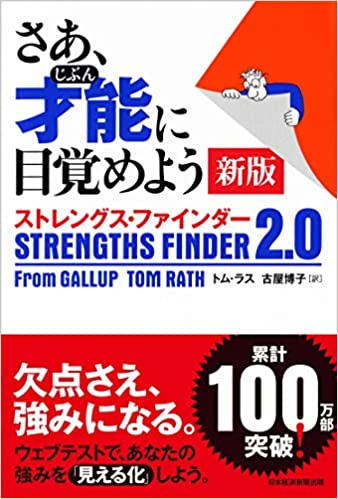

<!-- prettier-ignore-start -->

## 転職先から本が届いた

2021年1月から転職先での勤務がスタートするということで、業務に使用するPCを配送してもらった。

さすが、しっかりとハイスペック。前職では新卒のとき**メモリが4GB**だったことを思い返すと涙がちょちょ切れそうだ。

ちなみに入社から数年後、ハイスペックなPCをやるぞ！と言われて支給されたノートPCはたしかに演算能力はマトモになったのだが、**解像度がHDだった**。（メーカーサイトを調べたら同機種でフルHDの選択肢もちゃんとあったにも関わらず。）

まあ、とはいえ外部ディスプレイは支給されていたのだが、ずいぶんと人権のない生活を強いられていたな、と思う。

**それはさておき、PCに1冊の本が同梱されていた。**

「[STRENGTHS FINDER 2.0](https://amzn.to/37Nq7US)」である。

## STRENGTHS FINDER 2.0とは

表紙はこんな感じだ。

「**さあ、才能に目覚めよう**」とあるように、自分にどんな強みがあるかを分析するための本だ。

強みを発掘するためのWEBテストのアクセスコードが同梱されていて、購入者は有償のテストを無料で受けることが可能。

もしかしたら入社後の研修で同時に受ける感じのやつかもしれないが、勝手に実施してしまった。**社会性が欠如しているタイプの人間**である。

まあ、もし研修時に受験必須なら自腹で有償受験すればいいだけなので問題はなかろう。

人生において大事なのは空気を読むこと以上に、不必要に空気を「**読まない**」ことだ。読めないのは論外だが、読めたところでそれに常に従っているようでは結局コントロール性がない。ということで勝手にやった次第。

## 私が持つ資質TOP5

テストを受験して明らかになったのは以下の5つの資質だった。

1. **指令性**
1. **活発性**
1. **自我**
1. **未来志向**
1. **収集心**

自覚的な得意分野と比較しても違和感のない結果となったと感じる。

これらの資質に対して、書籍では以下が述べられている。

- 挙げられた資質が具体的にはどういった性質を指すのか
- 同じ資質を持った様々な分野で活躍する人の発言サンプル
- その資質を活かすための行動ヒント
- その資質を持つ人への上手な接し方

## 読んでみた上での自己分析

内容をすべて紹介すると膨大な量になってしまうので、自分の備忘録も兼ねてザックリまとめておこうかと思う。
ちなみに各項の説明文は「**あなたのクリフトンストレングス34の結果**」から引用したものである。

### 指令性
> あなたには強い存在感があります。状況の主導権を握り、決断を下します。

### 活発性
> あなたは、アイデアを実行に移すことで物事を進めます。単に話すだけではなく、いますぐ実行することを望みます。

### 自我
> あなたは、大きなインパクトを与えることに駆り立てられます。独立心に富み、組織や周囲の人々に与える影響の大きさに基づいてプロジェクトに優先順位を付けます。

### 未来志向
> あなたは、未来と、そこで起こり得ることに触発されます。未来についてのビジョンを語ることで、人々にエネルギーを与えます。

### 収集心
> あなたは、収集し保管するニーズがあります。その対象には、情報、アイデア、芸術品だけでなく、人間関係も含まれる場合があります。

### トップ5の資質を見て
> 〈収集心〉により得られる卓越した知識や情報をバックボーンに、〈活発性〉から実体験を通じて経験知を積み重ね、それらをもとにして〈未来志向〉の見通す力をもって未来へのビジョンを描き、〈指令性〉を発揮して周囲の人々を感化・モチベートし、〈自我〉の影響力をガンガン高めて人生を充実させる

というようなストーリーになるだろうか。

これは、本テストを受ける前から自分なりに考えていた成功哲学のようなものと矛盾しておらず、私の自己分析がそれなりに正確であることが確認できたので非常に良かった。

ちなみに、テストを受ける前の自己分析はザックリ以下のようなものだ。

- **知的好奇心が旺盛である**
- **戦略性のない単純な努力を忌避する傾向にある**
- **ただし最終的に楽をするためなら努力を惜しまない**
- **面接や文章を書くなど自己表現はそこそこ得意**

個人的には、「自己表現や人に何かを勧める行為」は得意といえど知的好奇心よりは下位かと予想していたのだが、むしろ〈指令性〉がトップだったことは素直に驚いた。

よくよく思い返すと、今までの人生において「**自分が知人たちに何かを勧めているうちに、いつの間にか仲間内みんながやり始めている**」といった体験をそれなりにしていたように思う。

おそらく自分にとって自然体の行動すぎて強みをちゃんと自覚できていなかったということだろう。

今年（2020年）3月にブログを始めてから、それなりの数の人が自分の記事から商品を購入してくれ、ちょっとしたお小遣い程度のアフィリエイト収入を得るに至っているわけだが、それも〈指令性〉の資質あってのものだったのかもしれない。

## 逆に持っていない資質は何か
先ほどサラッと「**あなたのクリフトンストレングス34の結果**」によると、というようなことを書いたが、実はこのレポート、追加の課金（[数千円！](https://store.gallup.com/p/ja-jp/10003)）をしないと手に入らないものである。

テストは共通のものだが、書籍に付帯している無料バウチャーで明らかになるのは最も重要なTOP5の資質のみ。

無料でテストが受験できるなら、と本書籍の購入を考えている方もいるかもしれないが、苦手分野の資質を知るには追加課金が必要だということは先に述べておきたい。

もちろん、[STRENGTHS FINDER 2.0](https://amzn.to/37Nq7US)は**強みを認識し伸ばす**というコンセプトであるから、なにはともあれ重要なのはTOP5の資質である。

これをしっかり認識するのがまず大前提だ。

### 追加課金をした理由

それでもなお庶民には高額といえる数千円の追加課金をしようと思い立ったかといえば、このTOP5の結果を見て分析の妥当性を感じたからである。すなわち、それなりに信頼のできる分析をもとに、自分に向いていない分野をしっかりと認知しておくことで、効率の悪い努力をすることや苦手な場面を避けたりすることの対策が打てるようになると考えたためだ。

わざわざ転職先が入社に先立って送ろうとする書籍なのであるから、トコトン活かすことは決して悪いことではないはずだ。

## 私の資質ワースト5

さて、そうして明らかになった私が兼ね備えていない資質はどんなものだろうか。ワースト5を列挙しよう。

1. **慎重さ**
1. **包含**
1. **成長促進**
1. **共感性**
1. **回復志向**

これらがどういった資質なのか、備忘録として引用しておく。

### 慎重さ
> 「慎重さ」の資質が高い人は、決定や選択を行うときに細心の注意を払います。あらゆる道のりには、危険や困難が待ち受けていると考えています。

### 包含
> 「包含」の資質が高い人は、相手を受け入れることができます。人の輪から外れている人に注意を払い、そのような人を輪に入れようと努力します。

### 成長促進
> 「成長促進」の資質が高い人は、他の人の持つ可能性を認識し、それを伸ばします。小さな進歩の兆候を見逃さず、成長の証に満足感を得ます。

### 共感性
> 「共感性」の資質が高い人は、自分を相手の状況に置き換えて考えることにより、相手の感情を察することができます。

### 回復志向
> 「回復志向」の資質が高い人は、問題を解決するのが大好きです。どこに問題があるのかを探りあて、それを解決することに長けています。

### ワースト5の資質を見て
これも面白いほどに自分の自覚的な短所や思考傾向に一致していた。

が、これはむしろ喜ばしいことだと思っていて、これらの資質に関わる行為は基本的に私がこれまでの人生で積極的に忌避してきた行動ばかりだからである。

いくら空気を読まないことを心がけている私であっても、手痛い失敗などをすると本来追い求めるべきでない資質の欠乏に原因を感じてしまったりもする。落ち込んだり自信を失えば誰しも迷走しがちだ。

今回の苦手資質の可視化によって、たとえ一般的な価値観・倫理観と相違があっても、より自信をもって切り捨てることができる。**自分の人生を停滞させないためにも、得意分野を伸ばすことに注力したい。**

#### 慎重さ
まず、自分は活発性が高いのでリスクよりも経験を重視するため〈慎重さ〉はない。

#### 包含
仲間外れを作らないという馴れ合いに意味は見出しておらず、合う人だけで集まるほうがいいに決まっていると考えているので〈包含〉もない。むしろ部外者は締め出したいと考えるタイプ。

#### 成長促進
また、人の資質を見つけ出す、とか読んだだけでも効率悪そうで嫌気がさすので〈成長促進〉もない。すでに明らかな資質を活かすほうが効率がいいし、そもそも〈指令性〉が高いので主導するのは自分自身だと考えている。

#### 共感性
自分の感情すらうまく整理できない人が多いのに他人の感情など理解できるわけがないので〈共感性〉もない。そもそも理解しようと思っていない。

#### 回復志向
さらに、そもそも筋が悪くて問題が発生してしまっているようなものをチマチマ分析して直す、みたいな慈善事業のような行為はかなり嫌いで、それならスクラッチで1からやらせてくれ、と思うタイプなので〈回復志向〉もない。

## さいごに
こうしてみるとクライアントに対してサービスの導入を促すコンサル的なポジションも視野に入れつつ、エンジニアとしての技術をしっかり磨くことで実力が発揮できそうだなと感じる。

そして、転職先の話を伺う限りでは幸いなことにそうしたロールが期待されていそうだ。

さらに、前職で求められていた役割は記事で取り扱っていないものも含めて、おおむね下位資質に該当するものが多かったので転職の選択は間違いでなかったと納得できるものだった。

**いやはや、またしても正解を引いてしまった。敗北が知りたい。**

この記事を読まれた各位も、実際に転職するかは別として、少なくとも「現在の職務と自分の強みとなる資質が一致しているか」というのを[STRENGTHS FINDER 2.0](https://amzn.to/37Nq7US)で確認しておくのは非常に有益なのではないかと思う。

今のポジションにしろ新しいポジションにしろ、より自分が力を発揮できる場面を意識して職務にあたることは重要だろう。

長くなってしまったので、今日のところはこれにて終い。

<!-- prettier-ignore-end -->
