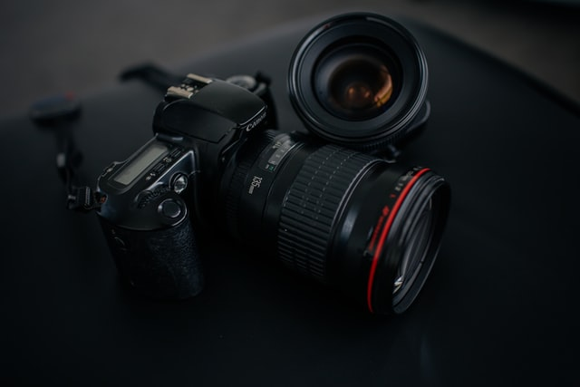
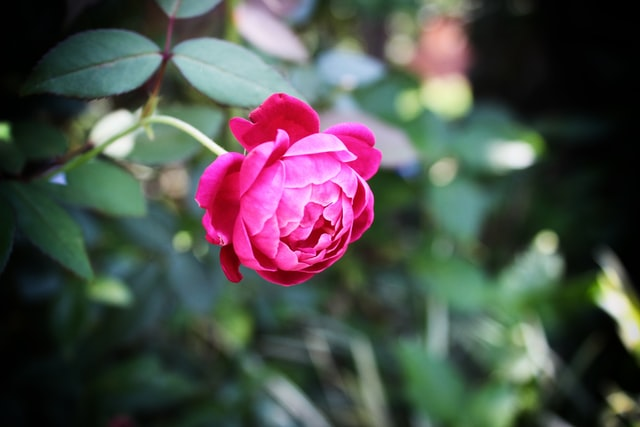
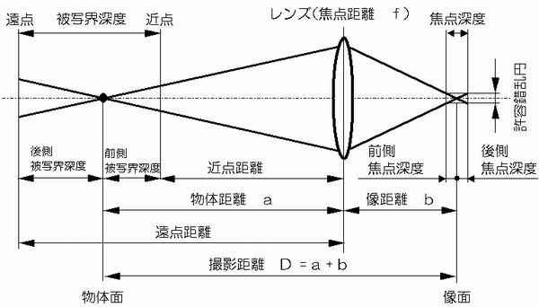
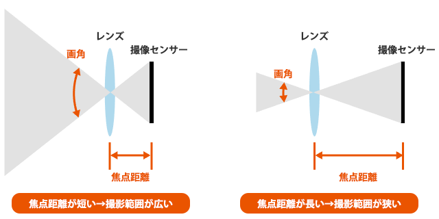

<!-- prettier-ignore-start -->

## カメラがほしい

どうも、自制心のなさに定評のあるクラウドエンジニア、タナイです。

1月に入社したばかりで、まだAZ-900を取得しただけなのにクラウドエンジニアを気取っているクソ野郎、それが私だ。

さて、そんなことはどうでもよいとして、カメラがほしい。iPhoneについているカメラとか、そこらへんの家電量販店のPCコーナーに売ってるwebcamじゃない、ちゃんとした一眼レフだ。

しからば、その一眼レフとやらになにを求めるというのか？

「**背景をぼかしたいい感じの映像が撮りた〜い！**」

これに尽きる。さすがニワカっぽい理由、安心感がある。

## なんでいい映像が撮りたいのか

これにはいくつか理由があるが、だらだら述べても仕方がないので箇条書きで。

- 娘の写真をいい感じにする（家庭的な建前）
- web会議の映像を差別化したい（個人的な本音）
- きたるYouTube配信用（オマケ）

要するに、娘の写真を撮るという大義名分を振りかざして、普段はwebcam代わりに自分が使うことでweb会議の映像をガチって会う人々になんとなくイイ感じの印象を植え付けようという作戦である。

一応書いておくと、一眼レフっていうのは、こんなやつのこと。いわゆるガチなやつ。

## 一眼レフだと普通のwebcamとなにが違うのか？

そもそも、なぜ一眼レフだとイイ感じの映像になるのだろう。

もし、それが一眼レフに特有の要因でないならば、代替手段も検討できる。つまり、カメラの原理に詳しくなることは必須だ。

調べ物は好きなので、例のごとく他の全てを放棄して色々調べてきた。せっかくなのでまとめていこう。

- **被写界深度／焦点深度**
- **絞り／F値**
- **パンフォーカス／ボケ**
- **シャッタースピードと手ブレ補正**
- **ミラーレス**
- **センサーサイズ／画素数**
  - **フルサイズ**
  - **マイクロフォーサーズ**
  - **APS-C**

ボケた写真になる理由は後述するか別記事にするとして、なにが違うのか。

### すべてはセンサーサイズから

まず、普通のwebcamやiPhoneのカメラと一眼レフで決定的に異なるのが、**センサーサイズ**である。

カメラというのはレンズを通ってきた光をセンサーで受光して映像信号に変換する。昔のカメラでいうならばフィルムに相当する部分になる。

で、結局これが画質に対して支配的な要素であるわけだ。カメラではよく何百万画素とか画素数が取り沙汰されているが、同じ画素数でも受けるセンサーのサイズが異なれば、1画素あたりのサイズも変化する。

パソコンのディスプレイとかを考えるとイメージが付きやすいかもしれない。同じ4Kのディスプレイでも27インチくらいだと綺麗だが、19インチだと小さすぎて文字を大きく表示することになって意味がない、みたいな感じ。

なんでも小さいところに詰め込みすぎると問題が生じるというわけだ。

そして、一眼レフだとiPhoneカメラよりはるかに大きいサイズのセンサーが搭載されていて、その中でも大きい順に**フルサイズ**（フィルムと同じサイズ）、**APS-C**、**マイクロフォーサーズ**という順でラインナップがある。

おおむねセンサーが大きいほど本体価格は高い。各メーカーで若干異なるようだが、フルサイズは新品で15-20万から、APS-Cなら10万切るくらいから、といった価格のイメージだ。

※下記はCanonの例、左からフルサイズ（プロクラス）、フルサイズ（ミドルクラス）、APS-C（エントリーモデル)。

<iframe style="width:120px;height:240px;" marginwidth="0" marginheight="0" scrolling="no" frameborder="0" src="//rcm-fe.amazon-adsystem.com/e/cm?lt1=_blank&bc1=000000&IS2=1&bg1=FFFFFF&fc1=000000&lc1=0000FF&t=dev00d-22&language=ja_JP&o=9&p=8&l=as4&m=amazon&f=ifr&ref=as_ss_li_til&asins=B08CMZYB4B&linkId=d8d85e4d478e3dc2aa78ef514a71854e"></iframe>
<iframe style="width:120px;height:240px;" marginwidth="0" marginheight="0" scrolling="no" frameborder="0" src="//rcm-fe.amazon-adsystem.com/e/cm?lt1=_blank&bc1=000000&IS2=1&bg1=FFFFFF&fc1=000000&lc1=0000FF&t=dev00d-22&language=ja_JP&o=9&p=8&l=as4&m=amazon&f=ifr&ref=as_ss_li_til&asins=B07H8WYM4Z&linkId=db40b158e841dd22ff989ed160c3b098"></iframe>
<iframe style="width:120px;height:240px;" marginwidth="0" marginheight="0" scrolling="no" frameborder="0" src="//rcm-fe.amazon-adsystem.com/e/cm?lt1=_blank&bc1=000000&IS2=1&bg1=FFFFFF&fc1=000000&lc1=0000FF&t=dev00d-22&language=ja_JP&o=9&p=8&l=as4&m=amazon&f=ifr&ref=as_ss_li_til&asins=B08L4WWX1N&linkId=b597e2998d3282f5698f69cd36785ad9"></iframe>

### レンズ

カメラをやっていない人にとっては呪文めいた言葉の数々がある。**F値**、**焦点距離**、**被写界深度**、**シャッタースピード**、**感度**、**画角**とかいった感じの言葉たちだ。

これらは使用するレンズに大きく左右される。

とりあえず今回はボケみのある写真を撮るのをテーマに軽く説明してみよう。

まず、ボケた写真とは下のように特定の対象にのみピントが合っていて、それ以外はボヤけた感じになっている写真のことだ。

対して、ふつうiPhoneのカメラで撮る写真は奥から手前までぜーんぶクッキリ写っている。これはパンフォーカスといって全体にピントが合っている状態になる。

つまり、ボケた写真を撮るためには、奥行方向にピントが合う範囲をあえて狭める必要がある。

この奥行方向にピントが合う範囲の広さのことを**被写界深度**と呼ぶ。

そしてこの被写界深度を浅くするには、F値を下げ、焦点距離を大きくし、被写体に近づいて撮ることが求められる。

### F値

F値とは**絞り値**のことである。F値が大きくなるほど、目を細めて見るイメージに近い。

目が悪い人は分かりやすいと思うが、目を細めると普段より遠くのものがハッキリ映るだろう。ボケさせるにはこの逆、F値が小さいレンズを使用する必要がある。

すなわち目をかっ開いた状態に近い、より光を多く取り込むレンズがF値の小さいレンズとなる。

これは、たとえば使用するレンズの枚数が少ない（＝より光を通しやすい）**単焦点レンズ**などがそれにあたる。

では、なぜ目を細めるとピントが合うのだろう？それはレンズの収差によるものだ。

理想的なレンズでは光は誤差なく1点に集まるが、現実に存在するレンズには歪みがあるので、どうしてもレンズの中心から離れた位置を通過する光ほど焦点とはズレた位置を通る。

そう、このときのズレがボヤけとなって写真に現れるのである。

目を細めると、レンズ（ここでは眼球）の中心から離れた位置を通る光が遮られ、焦点の合いやすい中心部分の光のみを見ることになるのでピントが合ったように見えるということだ。

具体的にはF2.8を切るくらいでないとイイ感じにボケみのある写真は撮りにくいらしい。

### 焦点距離

同じ構図の写真を撮る場合に、近くから撮るのか、離れた位置からズームするのかでボケみが変わってくる。

失礼、ズームというと色々ありすぎて語弊がある。焦点距離の大きいレンズで近づいて撮るのか、焦点距離の小さいレンズで遠ざかって撮るのか、の違いだ。

焦点距離というのはレンズによって固有のものだ。ちなみに、複数枚のレンズを組み合わせて焦点距離を変化させられるレンズのことを**ズームレンズ**という。

ズームレンズは単焦点レンズと比較してレンズの枚数が多いので、巨大な高級品でもないと基本的に光を通しにくく、F値は大きくなる。つまり、ズームレンズはボケみのある写真撮影にはあまり向かない。

話を戻そう。焦点距離の大きいレンズのほうが、よりボケる。なぜか？

これには、**許容錯乱円**の理解が必要だ。といってもそんなに難しくないので安心してほしい。

先ほど、センサーサイズと画素数の話をした。この2つが決まると1画素あたりのサイズが自ずと決まる。当然ながら1つの画素の中は全部が同じ色になる。つまり画素よりも小さいサイズの変化があっても、それをカメラは捉えることができない。

さて、レンズを通った光は焦点に集まる。理論上のレンズであれば真の意味で「点」に集まることになるが、先ほども述べたとおり実際には誤差があり「円」となる。

この円のサイズがセンサー上の1画素のサイズより小さければ、ピントは合う。それ以上に小さい変化は物理的に捉えられないのだからそれ以上にはピントは合わせられない。

このときのセンサー上の1画素のサイズが許容錯乱円ということになる。

つまり、被写体からレンズを通って結像する光が、許容錯乱円よりも大きい円に集光している場合、ピントが合わずにボケる。そして、この集光した円の大きさを支配するのが焦点距離なのである。

理解のために画像を引用しよう。

> 
> 引用元：[焦点深度、被写界深度、絞りとの関係](https://imagingsolution.net/imaging/opt/depth-of-focus-field-aperture-relationships/)

まず、これまで使っていた言葉がどういう位置づけかというのがわかるかと思う。

ちなみに焦点距離というのはレンズからセンサーまでの距離のことである。ここでいう像距離のことだ。

> 
> 引用元：[レンズの何mmって何？焦点距離って何？](https://www.sierrarei.com/camera-shotenkyori/)

こちらの画像も合わせて見れば、焦点距離が遠いほど、同じ焦点深度に対して被写界深度が狭くなっていくイメージがつかめるのではないかと思う。

## 次回につづく

ちょっと長くなってきたので、やる気が出たら次回以降も書いていこうと思う。
個人的に調べていて知りたくなった範囲のことはだいたい書けた。

わかりにくい！とかもっと知りたい！とかあったらぜひTwitterのほうにリプなりDMなり飛ばしてもらえると助かります。

<!-- prettier-ignore-end -->
