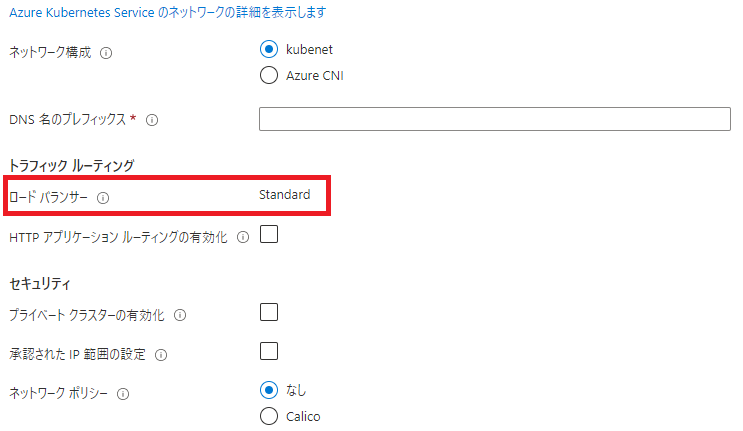

## 混同しがちなのでいったん整理

Azure Kubernetes Service（以下AKS）で、SNATまわりってどうなってるんだっけ？というのが発端。

このあたりはOSSからpreviewになったり、気付いたらGAされているような機能もあるのでなかなか頭の中を整理しておくのが大変だ。

とりあえず、[Microsoftテクニカルサポートチームの記事](https://jpaztech.github.io/blog/containers/aks-load-balancer-sku-and-snat-options/)を参考としておいておく。

## デプロイ内容に関して

### LoadBalancerのsku

`BasicSKU`と`StandardSKU`がある。AKSクラスタの作成時に指定。

BasicSKUはクラスタ作成時にLoadBalancerが作成されない（PublicIPも作成されない）。

```bash
az aks create \
-n <aks-cluster-name> \
-g <resource-group-name> \
--load-balancer-sku basic
```

### Network

`kubenet`と`Azure CNI`がある。

AKSに触り始めた当初は盛大に勘違いしていて、Azure CNIを利用する場合は`MC_`から始まるAKS内部のリソースグループは作成されないと思っていた。

LoadBalancer含め、CNI用のVnetと同じリソースグループに自前でリソースをデプロイして紐づけ作業をしたりすることを想像していたのだったか。
よく考えればそんなわけはなくて、そもそもネットワーク以外にもノードプールとかありまんがな、という話である。

ということで、**Azure CNIであろうがMC\_始まりのリソースグループは作成され、**その中にサービスとしてのロードバランサーも作成される。

つまり、Azure CNIとkubenetにこの部分で違いはない。

## 要注意なのはBasicSKUでのクラスタ作成

いろいろ自分でも調べてみた結果わかったこととしては、Azure CNIだろうがkubenetだろうが、`--load-balacner-sku basic`を指定してクラスタを作成する場合はLoadBalancerは同時に作成されない。

上記の[MSのブログ](https://jpaztech.github.io/blog/containers/aks-load-balancer-sku-and-snat-options/)の通りでしかないが、`--network-plugin`による変化がないことがこれではっきり分かった。

つまり**BasicSKUの環境において、LoadBalancerが作られる前に外部との通信をすると、StaticなIPでの通信にはならない**（Nodeの再起動などに伴ってIPが変化する可能性がある）。

クラスタ外部との通信をするにあたって、多くのAzure PaaSとの通信はPrivete Linkがサポートされ始めているので、基本的にはPrivate Endpointを使用すればよいが、Public経由での疎通でIP制限をする場合などは注意が必要だ。

ちなみに、Azure PortalだとLoadBalancerをBasicSKUで作成することはできないっぽい（既定でStandard表記となり、画面上では変更できないようになっている）。



そのため、Azure CLIで明示的に指定しない限りはBasicSKUになることはなく、使い方によっては稀なケースとなる。

そうした場合に「これまでは何もしなくてもSNATは固定的だったから気にしなくていいや」という感じで理解してしまっていると思わずハマる可能性がある。

### Azure CLIでBasicSKUを指定する例

コピペ用にどうぞ。細かいその他のオプションは[Docs](https://docs.microsoft.com/ja-jp/cli/azure/aks?view=azure-cli-latest#az_aks_create)を参考に。

```bash
RESOURCE_GROUP_NAME=<input your resource group name>
AKS_CLUSTER_NAME=<input your aks cluster name>

az aks create \
-g $RESOURCE_GROUP_NAME \
-n $AKS_CLUSTER_NAME \
--load-balancer-sku basic \
--network-plugin kubenet \
--node-count 1 \
--node-vm-size standard_b2s \
```

ケチケチしているのでノードVMは最安のものを1ノードで指定している。おとなしくACI使えよってレベルの指定だが、検証なので無駄にリッチにしてもしょうがない。

## 内部ロードバランサーをデプロイする場合

通常どおりymlを書いてServiceをapplyするとパブリックなロードバランサーが作成されるが、アノテーションを付けることで内部ロードバランサーを作成させることもできるようだ。

下記は[Docs](https://docs.microsoft.com/ja-jp/azure/aks/internal-lb#create-an-internal-load-balancer)から引用したymlになる。

```yml
apiVersion: v1
kind: Service
metadata:
  name: internal-app
  annotations:
    service.beta.kubernetes.io/azure-load-balancer-internal: 'true'
spec:
  type: LoadBalancer
  ports:
    - port: 80
  selector:
    app: internal-app
```

> ノード リソース グループ内にAzure ロード バランサーが作成され、AKS クラスターと同じ仮想ネットワークに接続されます。
> サービスの詳細を表示すると、内部ロード バランサーの IP アドレスが EXTERNAL-IP 列に示されます。 このコンテキストでは、"外部" はロード バランサーの外部インスタンスに対するものであり、パブリックな外部 IP アドレスに対するものではありません。

ということらしい。ちゃんと内部ロードバランサーでも内部宛に公開されているIPをEXTERNAL-IP列に表示してくれるとな（というか、そうじゃなかったら普通にめんどい）。

## まとめ

それなりに自分の中で整理がついたのでヨシ！

Azureは資格取得を通じて理解が進んできたものの、肝心のKubernetesにちゃんと精通しないとダメだなと思う今日この頃。キャッチアップすべきものが尽きなくて楽しい。

それこそVBAをやっていた頃は、言語として活発な更新もなく掘りつくされた果ての枝葉末節にある仕様をたまに見つけては一喜一憂の自己満足していたわけで。

そういうのも技術を探求することなのかもしれないが、個人的には他人がやり終わったあとのRPGゲームのマップ探索ではなく、新しいゲームをやりたいと思うし、それはごく自然な感情だと思う。

つまりは、活発に開発が進んでいる領域こそキャッチアップを無限に楽しめるし、今この瞬間からでも頑張れば少なくとも「新機能にとても詳しい」人になれる。

もちろん、大手企業に在籍して大勢で「[仕事ごっこ](https://amzn.to/3w15miO)」していたのに比べれば、副業としてVBAで受託開発するのも非常に楽しかったのだけど、もともと非常に飽きっぽい性格なのもあり「次のゲーム」を探し始めてしまった。

正直、この小規模な受託開発、うまくやれば小遣い稼ぎとしての効率はいいのだが、**圧倒的な成長の実感**を伴わない行為は単なる時間の切り売りなので、アッサリやめたという次第。

金銭より何より、**昨日の自分より今日の自分は優れている**と思える人生こそ素晴らしいと思う。

[](https://amzn.to/3w15miO)
