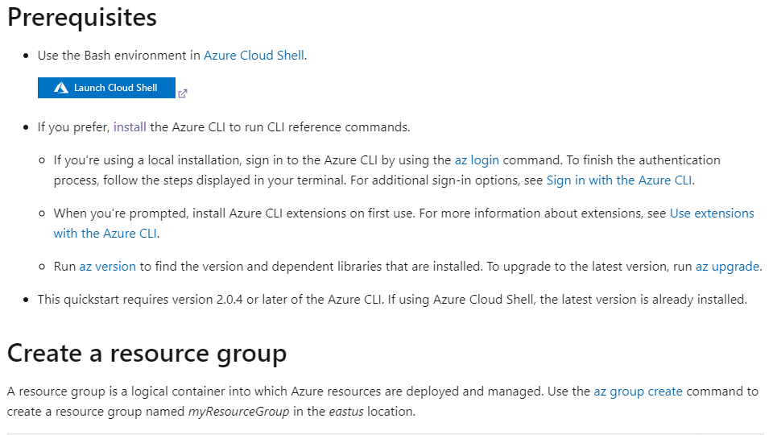

<!-- prettier-ignore-start -->

## 人生で初めて作ったChrome拡張

作ったものは本当にごくごくシンプルなのだけど、まずは画像を見てもらうのがいいかもしれない。

Docsの日本語翻訳はたまにおかしいときがあるので、まれによく元の英語も確認したくなるけども、翻訳の切り替えボタンはページの上部にあり、しかも全文が一気に切り替わってしまうので面倒という問題がある。

とはいえ、最初から英語で読むのはそれはそれで日本語で読むよりはさすがに時間がかかってしまう。ネイティブ日本人なのでそれは仕方がない。

こんなとき、Google「逆」翻訳みたいなことができないかなーとふと思い付いたのがキッカケ。

細かい単位で要素ごとにチョコチョコ切り替えて確認したら戻せるってなれば楽ですよね。
ということでダブルクリックするとその部分の言語が切り替わるようにしてみた次第。

## とりあえず拡張機能ストアに申請したら審査が通った

自分で使うだけなら別にストア公開する必要はまったくないのだけど、まあこういうのって最初の1個目ができるとあとは思い付いたときにポンポンできるからね。

つまりは今後の大ヒット作をよりスピーディに世に出すために今のうちに一般公開にトライっていうわけ（これを取らぬ狸の皮算用と呼ぶ）。

そんなこんなでいつの間にか審査も通ったので下記のURLにて公開されております。

https://chrome.google.com/webstore/detail/ms-docs-lang-switching-ex/cnjicflfhpockfnlaapkbclbnfaocpdb

ぶっちゃけ、本体のコード作るより申請の方が時間かかりますよコレ（アイコン画像の透過処理とか1pxでもずれると通らなかったりする）。

## 本体部分はまれに見るクソコード

審査通す前にリファクタリングすれば良かったのだけど、作った直後のクソコードで申請してしまった……。

とりあえず[GitHubにはUPしてあります](https://github.com/thanaism/ms-docs-lang-switching-chrome-extenstion)が、恥ずかしいコードなので絶対に見ないでください。

尾　張

<!-- prettier-ignore-end -->
