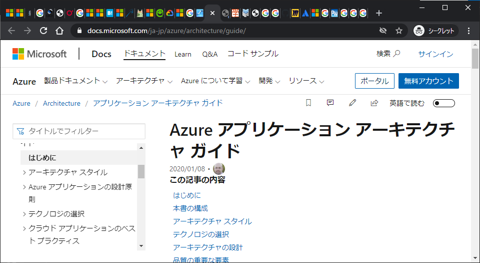
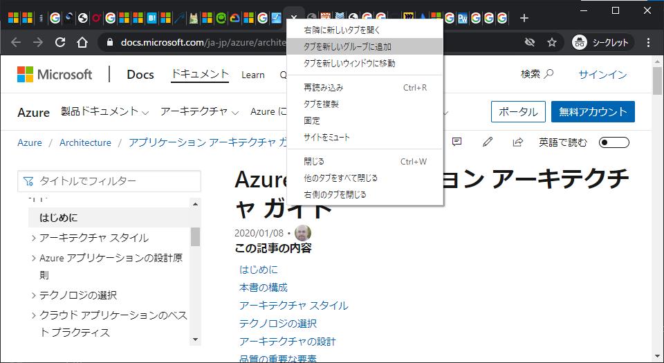
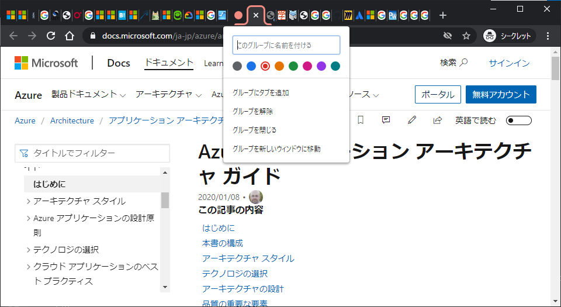
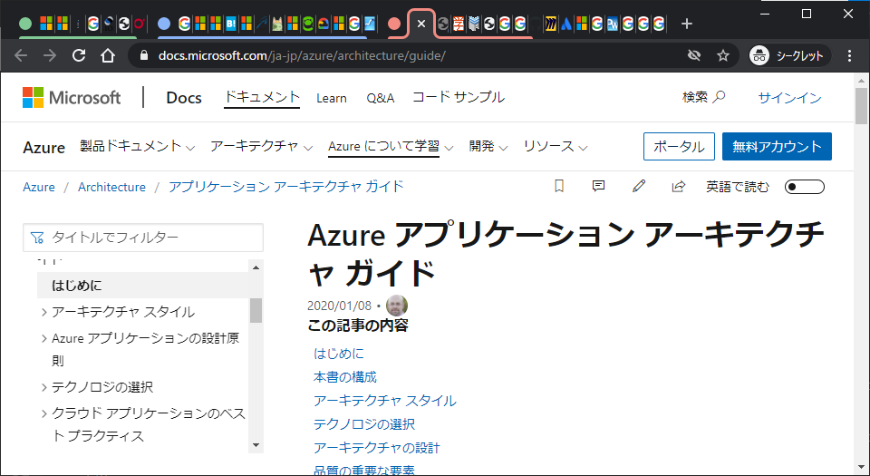
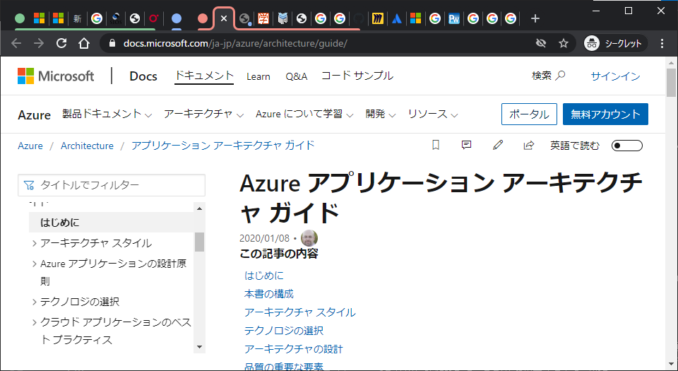
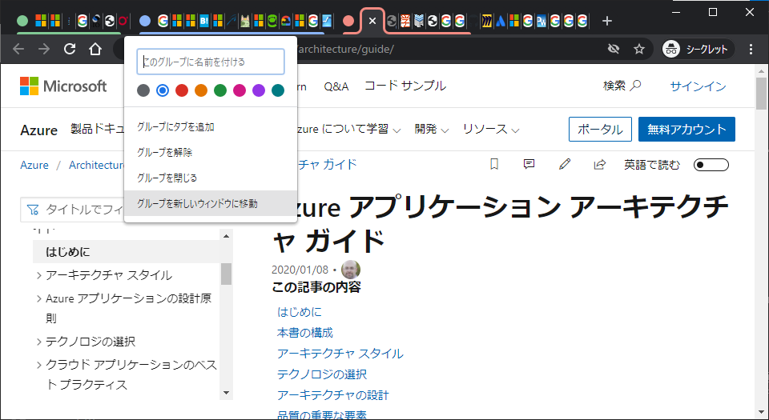
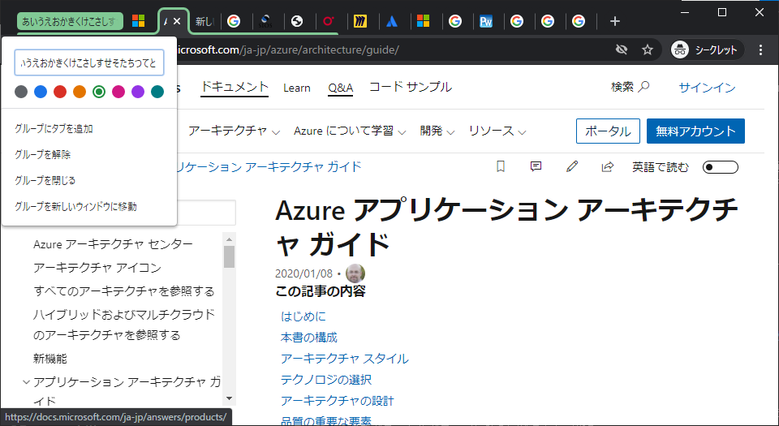

## 人は皆タブを開きすぎる宿命をもつ

仕事でもプライベートでも調べ物をしていたらこんな感じになることはないか。

この**おびただしい数のタブ**。

ちゃんと整理しながら見ろという話で済めばよいが、残念ながら人類は整理整頓と効率的な調べ物を両立できるようになってはいないのだ。

いわばこのタブ大量発生は必然だといってよい。いつの日も対策は根本的である必要があるが、根本自体が無理筋なことも往々にしてあるのが人生の難しいところである。

しかし、その根本をも覆す世紀の大発見。実はコイツらを構造化して保持することができる機能が**Chrome純正で**存在するといったらどうだろう。

## 全人類は今日からタブをグループ化してくれ

もしかするとこの記事の読者の大多数には既知の機能なのかもしれないが、何を隠そう私は今日知った。時代遅れのロートルだと謗られても仕方がないレベルの見落とし、恥ずべき事態といって差し支えない。

とはいえ、この私が見落としていたのだ。つまり聡明な諸兄であっても見落としている可能性は大いにある。実際の該当者がもし少なかったとしても、今回は見落としていた場合の損失が大きいのでぜひとも共有しようと思い立った。

そう、**タブをグループ化できる**。

## 百聞は一見に如かず

とりあえず画像を刮目して見ていってほしい。今日伝えたいのはガチのマジでこれだけ。

タブの上で右クリックすると上から2番目に「**タブを新しいグループに追加**」という項目がある。

名前を付けることもできるが、その下の色の付いた●マークでの管理がオススメだ。今回は赤色を選択している。この作業を繰り返そう。shiftを押して連続する複数タブを一気に選択することもできるし、ctrlを使用して離れたタブを複数選択することも可能だ。

そうするとタブに色付け＆エリア分けができる。これだけでも十分わかりやすいが、例えば青い●マークをクリックしてみよう。

なんと、グループ単位でfoldできる。そう、適切に折りたたむことによって**タブのタイトル見えにくい問題**が解消される。

さらに、「**グループを新しいウィンドウに移動**」というアクションも用意されている。●マークをドラッグ＆ドロップしても同じことが可能だ。

ただし「グループを閉じる」でグループごと閉じた場合は通常のタブと同様に`ctrl`+`shift`+`T`してもグループごと復活させることはできない（1枚ごとの復活になるのでタブ枚数だけ操作を繰り返す必要がある）。

ちなみにグループに名前を付けると●マーク部分にちゃんと表示されるが、あんまり長い名前を付けると見切れる。

## おわりに

これで諸兄も生産性爆上げ間違いなし！それでは今日のところはこれにておさらば。
