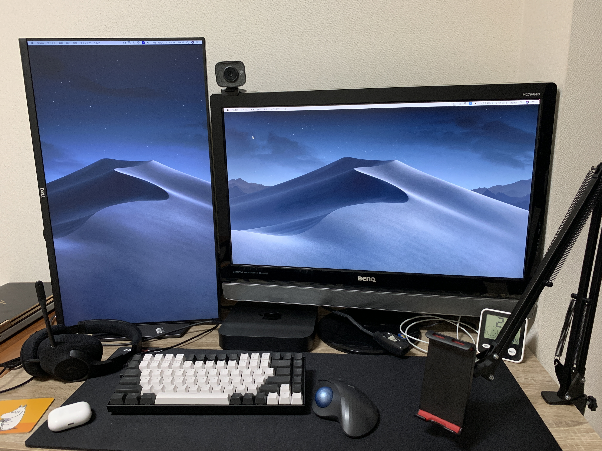

<!-- prettier-ignore-start -->

## リモートワークで増す自宅環境の重要性

私はコロナ禍で転職したのもあり、今は地方在住かつフルリモートで働いている。  
なんと入社から一度も本社に行っていない。筋金入りのフルリモート社員である。

とはいえ、私のように出社なしを前提に入社しているような人でなくとも、昨今のコロナ対応でリモートワークを余儀なくされている人も多いことだろう。

そう、ここで大事なのはいかに快適に仕事をするかということだ。とにかく、仕事というのは快適でなくてはいけない。

ほとんどの人は最低でも1日8時間は働くはずだ。多少高いお金を払ってでも、自分の能率が最大限に発揮されるような環境づくりに投資することは、費用対効果の高い営みだといえるだろう。

とにもかくにも私はそれなりに費用を投じて環境構築してきたので、悩める誰かの参考になればと思い、本記事にて私のデスクを紹介することにした。

## 特に費用対効果の高いアイテム3選

完全に私の主観だが、費用対効果の高いものを先に述べておきたいと思う。

### 1位 外部モニター

なんといってもまずはモニターが重要。ノートPCの小さいモニターで効率的な業務を行うのは**不可能**である。

そう断言できるほどにモニターのもたらす効果は大きい。そして今は高品質なモニターがとても安い。  
そして、私の独断と偏見で圧倒的にオススメするのは**DELLのモニター**である。

DELLのモニターのよいところを3点あげておく。

- スタンドが高機能（回転に対応している製品が多い）
- 電源ユニットが内蔵（邪魔なACアダプタがなくコードのみ）
- ドット抜け保証（高いモニターでも他社製だと泣き寝入り）

### 2位 ヘッドセット

リモートワークといえばウェブ会議だ。Slackなどのチャットツールによるコミュニケーションが盛んといえど、やはりウェブ会議は仕事をする以上避けられない。

そこで重要になるのが通話品質だ。特に自分の声を品質良く確実に相手に届けるという意味で、ヘッドセットは必要不可欠である。

もちろん、置くタイプのマイクでも音質という観点では悪くはないのだが、会議をしながらキーボードで議事メモを取るケースであるとか、隣の部屋で子供が泣いているケースなどで広く集音するタイプのマイクは会議の阻害要因になる可能性は高いと言える。

私のようにキーボードは絶対にメカニカルキーボード（騒音発生装置）がいいというような人間には必須のアイテムだ。

### 3位 椅子

私も最初は椅子は普通のもので大丈夫だろうと高を括っていたのだが、長く使いすぎてガタガタになっていたので清水の舞台から1000回飛び降りるつもりでバチクソ高級品を買ったらシンプルに腰痛がなくなったので椅子を推しておきたい。

ただ、腰痛とかが特に無いようなら高級椅子はわりと財布に厳しいので、代わりに後述の[ドッキングステーション](https://amzn.to/2Qi14TK)を推したい。これは、仕事終わったあとも私用のPCで趣味の作業を行うような人には特に。

## 私のデスクを紹介する

重要事項を先に述べたところで、私のデスクの外観と各アイテムを紹介しよう。

### デスクチェア

[Okamura Sabrina](https://amzn.to/3mKecgD)を使用している。バチクソ値が張るが、フルリモートで四六時中座ることになるので買った。おかげで腰痛知らずになったので後悔はしていない。

### モニター

縦置きしているのが[Dell S2721HSX](https://amzn.to/3wPIUtp)で、横置きしているのが[BenQ M2700HD](https://amzn.to/2PY7Oq5)だ。

BenQは入力端子が豊富なので、テレビゲームなどもつなげるのだが製品としては廃盤であり、娘が生まれてからゲームも全くしないので代わりにDellの4Kモニタ[S2721QS](https://amzn.to/3ts5ohK)を買おうと思っている。

個人的には解像度は**27インチのフルHDMIでも十分**に感じるが、最近はもうちょっと攻めてQHDでも見えるかなー、と思い始めている。

ではなぜ4Kを買おうとするのかという話だが、スケーリングを150%にすればQHDモニター相当、200%にすればフルHD相当として使えるので、PCスペックとお財布事情さえ問題ないなら4Kは上位互換なのである。

ちなみにモニタの解像度とインチ数によるサイズについては以前に[別の記事](https://dev.thanaism.com/2021/01/display-resolution/)を書いたのでそちらを参考にしてほしい。

### デスクマット

[ARCHISS Massive Desktop Mat](https://amzn.to/3uLOACL)という5mm厚ほどの大判マットを敷いている。

デスクになにか落としたりすると音がうるさいので、厚みのあるマットを購入した。安いので失敗してもいいやと思って買ったが思いのほか良くて敷いたままにしている。

マットを汚したくないという気持ちがはたらくので、デスクでメシを食うという行儀の悪い行為を控えることにつながるという嬉しい副次効果もある。

### トラックボール

マウスではなく[Logicool M575](https://amzn.to/3wTNmao)というトラックボールを使用している。

トラックボールはごく最初の使い始めは違和感があるが、1日もたてば慣れる。机の上にメモボードなどを置く際もマウスと違って直近ギリギリに配置しても問題ないので非常によい。

キーボードの真横から離れることがないので右手の移動距離が少なくて済む。操作端末が常に固定位置にあることの快適を知った。

### キーボード

[KeyChron K2](https://amzn.to/2QkY6Oi)は最高のキーボードだ。軸は青軸で購入したものを赤軸に交換して使っている。

海外輸入品でAmazonに直接の取り扱いがないので、キー配置がまったく同じものをリンクしておいた。

とにかく、この配列が大事なのだ。以前はFキーがなくさらにコンパクトな65%サイズのキーボードを使っていたのだが、コードを書く上で`Esc`と`\``が共用なのはつらい。

しかし、サイズはなるべく小さくあるべきだ。デスク上の空間は限られている。そこでこの配列は私にとっての完璧な必要最低限なのである。

### イヤホン

言わずと知れた[Apple AirPods Pro](https://amzn.to/3mIi2qw)を使っている。

ノイキャンとアクティブリスニングは神。他に言うことはない。

### ヘッドセット

通気性と軽量さを重視して[Logicool G433BK](https://amzn.to/3dbf8aH)をチョイスした。

今はそれなりに安いが、発売当時は高級機種だったようで接続端子が非常に豊富。しいて不満点をあげるとすればマイクの跳ね上げ機構がないこと。

つけっぱなしで飲み物を飲みたいときとかにサッと跳ね上げられないのは、ちと邪魔ではある。

通気性を妥協するならHyperXとかの[跳ね上げミュート対応品](https://amzn.to/32chNL2)を買ったほうがいいかもしれない。

### スマホアーム

[Unique Spirit](https://amzn.to/3se1TKw)というよくわからんメーカーの品。

正直、電話するというシーンがなく、業務中にスマホを使うパターンが本当にないので利用頻度は低い。

たまにネット回線がどうしてもつながらないとかの場合にスマホを固定してウェブ会議に出席できるのでそのようなシーンでは重宝する。

### ウェブカメラ

私にとっての圧倒的必需品、[Logicool StreamCam](https://amzn.to/32hlxdX)である。

値が張るだけあって画質は申し分ないし、スタンドが上下チルトだけでなく左右の首振りにも対応しているので画角コントロールは自在。映像品質は相手に届ける礼儀、これが本当のマナーである。

ノートPC付属のウェブカメラは外付けモニターとの親和性皆無なので、余裕があるならぜひ買っておきたい品のひとつといえる。

### ドッキングステーション

はいきた。これ最強。全人類は黙って[HP Thunderbolt Dock 120W G2](https://amzn.to/2Qi14TK)を買ったほうがよい。

どういうものかというと、thunderboltケーブル1本ですべてのPC接続機器を切り替えるためにある。イメージがわかないと思うので上記のリンクからAmazonの商品画像をいろいろ見てくれれば多少は分かると思う。

私の環境だとキーボード、トラックボール、ヘッドセット、ウェブカメラ、モニター2台がすべてこのドックに接続されていて、それらを**ケーブル1本で別のPCにつなぎ替えることが可能**。

Macを使っているときと、Windowsを使っているときでウェブカメラが変わってしまうなんてことはもうない。用意する機器は常に1台でいい。最高の1台をすべてのPCで使うことができる。

ただ、これには1つ罠があって、それは業務用に**thunderbolt3端子すらついていない貧弱なPC**を貸与されている場合には無用の長物になってしまうというケースだ。

thunderbolt3（最新はもう4だが）規格はとにかくデータ伝送が高速なので、モニターの映像情報4K60fpsを2枚分送ってもなお別の機器がつなげるだけのお釣りがくるという夢のような仕様なのである。しかも、給電にも対応しているので充電ケーブルすら不要。つなぐのは本当にコイツ1本でOKになる。

今どきのPCであればthunderbolt3の1つや2つくらい付いていて当然であるが、世の中にはHDMIどころかVGA端子しか付いていないおおよそ現代のPCというにはおこがましいゴミを貸与する企業もあるようだ。

もしそうであるなら、自宅のデスク環境を整えている場合では断じてない。今すぐその人権侵害に断固として抵抗し、転職することを勧めたい。

<!-- prettier-ignore-end -->
