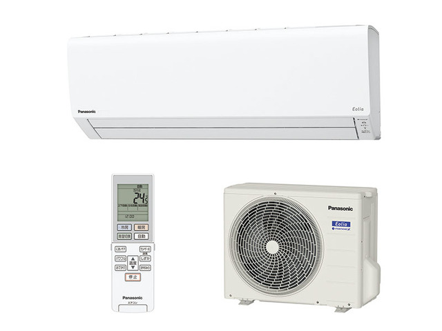

## エアコンを購入した

最近、異常なまでに暑くないですか？　少なくとも我が家は完全にバカの暑さです。

そうです。暑さでバカになってしまったので**賃貸なのにエアコンを2台も購入しまいました**。

賃貸の場合、いろいろな許可を取る必要がありますが、エアコンだけでなく電源の変更点も多くなりがちです。

許可の取り忘れでトラブルを避けるためにも、事前に把握しておくのがよいでしょう。

今回、とくに電源関係の話でいろいろと知識が足りず手探りの部分もあったので、忘れないうちに書き留めておこうと思います。

## なにはともあれ機種選定

まず、選んだものを結論から。

当初は業務用で圧倒的なシェアを誇るダイキンさんにしようと思ってましたが、価格と好みの都合により、私は[Panasonicの10畳用][10]と[HITACHIの6畳用][6]を買いました。

[10]: https://amzn.to/3A8Hw67
[6]: https://amzn.to/3zUtrci

※画像は[公式サイト][55]より引用

[55]: https://panasonic.jp/aircon/housing/p-db/CS-281DJS.html

参考までに価格のみを求めるなら、アイリスオーヤマやニトリの機種が第一候補になり、次点で東芝などが選択肢になるかと思います。

とはいえエアコンは一度買ったら10年選手です。賃貸の場合は、管理会社とオーナーに許可を取っての設置となりますが、大抵は原状復帰とセットになります。つまり引越し時には移設もありうるわけで、多少は頑丈なほうがいいと思い機種選定しています。

とはいえ定量的な評価をしたわけではなく、知人と家電量販店の店員さんに聞いた感じ（N<10）です。また、私がこれまで購入したエアコン以外のPanasonic家電製品で故障した例はありません。

## 隠れた選定基準、電源

エアコンはかなり電力を消費する機器のため、家庭の電源状況によっては設置できない可能性があります。

ざっくり書き出すと以下のような要素があります。

- エアコン専用コンセントの有無
- 電力会社との契約容量
  - スマートメーター
  - 漏電ブレーカー
  - 単相2線・単相3線

### エアコン専用コンセントの必要性

まず、昔と違い今は法令で決まっているらしく、エアコン設置工事にあたっては**専用コンセント**が必須のようです。

専用コンセントは、単に壁の高い位置にコンセントがあるというだけではダメで、ブレーカー系統もエアコン専有かつアースも必須となります。

もし、専用電源がない場合、工事となります。当然、賃貸であれば管理会社・オーナーへの許可取りが必要です。

専用コンセントがない場合、追加で15,000円程度の工事費用が発生します。

### 契約容量

エアコンの消費電力は大きいため、契約容量によってはエアコンをつけているあいだ他の家電製品がほぼ使えない状態になる可能性があります。

もし、エアコンを2台つけるのであれば30Aでは確実に足りません。その場合、電力会社に依頼して契約容量をアップして貰う必要がありますが、多くの場合、配電盤にある一番大きいブレーカー（サービスブレーカー）を交換する工事が必要です。

基本的に電力会社が無料で対応してくれる工事ではありますが、これも管理会社やオーナーに許可を貰う必要があります。また、契約容量をアップすると基本料金は高くなります。

### Looopでんきの場合

私のケースでは<a href="https://px.a8.net/svt/ejp?a8mat=3HGPJ1+7WL9HE+4H9U+5YRHE" rel="nofollow">Looopでんき</a>でしたので、事情が異なりました。

Looopでんきでは契約容量というものがそもそもありません。基本料金0円の完全な従量課金システムのため、サービスブレーカーは本来必要なく、配電盤の限界まで利用することができます。

ただし、地域の電力会社から普通に切り替えた場合、以前の契約容量に合わせたサービスブレーカーがそのまま残ります。そのため、実質的な容量アップのためにはサービスブレーカーを撤去し、バイパスするという工事が必要になります。

### バイパス工事では実質60Aまで容量アップする

多くの家庭で電源は単相3線/上限60Aという仕様のはずです。自宅の配電盤のサービスブレーカーを見ればおそらく「単相3線・20A」とか書いてありますので、方式と現状の契約容量はそれで判断できます。

一方で、まれに単相2線の家庭があるようです。こちらは上限30A程度になるはずです。

後述しますが、200Vエアコンの設置も確実に不可です。

### スマートメーター

サービスブレーカーを撤去するということは、退去時にサービスブレーカーを戻す必要が発生しそうですが、多くの場合そのままで大丈夫と言われるでしょう。

Looopでんきを契約している場合、スマートメーターに対応しているはずです。これは、遠隔操作で契約容量の変更や使用量の把握ができるメーターで、サービスブレーカーを兼用できます。つまりバイパス工事をしても機能は一切失われません。

### バイパス工事では漏電ブレーカーの仕様に要注意

一方で、配電盤の漏電ブレーカーの仕様によってはバイパス工事自体がNGとなる場合もあるそうです（我が家に来た工事の方に聞きました）。

漏電ブレーカーには短絡保護専用と過負荷兼用で2種類あります。もし短絡保護専用だった場合、過負荷に対応しておらず焼けてしまう可能性があるため、バイパス工事はできないということになります。

また、漏電ブレーカーの容量にも要注意です。後述しますが、単相3線で30Aの漏電ブレーカーであれば実質60Aまで対応可能です（片側30Aで計60A）。

### 単相2線と単相3線

先ほどから出てきている言葉ですが、[東京電力のページ][99]によい図がありましたので見てみてください。

[99]: https://www.tepco.co.jp/pg/consignment/for-general/basic-knowledge/monophase.html

単相3線式では、つなぎ方によって100Vも200Vも取れます。単相2線式はつなぎ方は1通りしかないため、100Vのみです。

漏電ブレーカーの片側30Aというのもつまりは単相3線式において、100Vを取る場合は片側しか負荷がかかっていないということです。

Ａ・Ｂ・Ｃと3本の線があってＢが中性線とすれば、100Vを取るのにＡ−Ｂの側とＢ−Ｃの側で2つの取り方がありますね。30Aの場合、どちらか片側で30Aをオーバーすれば落ちるので、バランス良く取れば30Aずつでトータル60Aまで使えるということです。

また、200Vの場合はＡ−Ｃで取るので上限30Aです。

### 単相200Vと動力200V

ここまでの話が理解できていれば、単相3線でエアコン専用コンセントがあれば200Vのエアコンも大掛かりな工事が必要なく設置できることがわかると思います。その場合、仮に今のコンセントが100Vだったとしても、端子の簡単な付け替えで済みますので、追加の工事費用もほぼかからないはずです。

一方で、勘違いしがちなのが**動力**の200Vです。これは**三相**3線式といって違います。

なまじ知っていると200Vといえば動力電源のことだと勘違いするケースがあります。動力電源は工場併設の自宅などでもない限り大掛かりな工事が必要な専用線となります。当然、電気料金も工事費もかなり高額です。

エアコンの200Vは動力電源とは違いますので安心して下さい。私は製造業にいたこともあり、最初勘違いしていました。

車いじりとかが好きな人も、200Vといえば動力という観念があったりして勘違いするかもしれません（私のことです）。

## おわりに

エアコン選定においては、これだけ知識があれば電源関係で困ることはあまりないかと思います。

賃貸物件でも管理会社とオーナーを説得して、涼しい夏を過ごしましょう。

（私のエアコンは1ヶ月後に届きます。まだまだ暑い日が続きそうです。）
