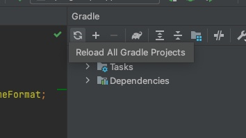

## Spring解体新書

私はSIerにいるのにJavaを使ったことがない。

ということで、[Spring解体新書](https://amzn.to/3ldoLcv)という書籍に沿ってSpring BootでWebアプリケーション開発のさわりをやってみる。

<a href="https://www.amazon.co.jp/%E5%BE%8C%E6%82%94%E3%81%97%E3%81%AA%E3%81%84%E3%81%9F%E3%82%81%E3%81%AESpring-Boot-%E5%85%A5%E9%96%80%E6%9B%B8%EF%BC%9ASpring-%E8%A7%A3%E4%BD%93%E6%96%B0%E6%9B%B8%EF%BC%88%E7%AC%AC2%E7%89%88%EF%BC%89-Spring%E8%A7%A3%E4%BD%93%E6%96%B0%E6%9B%B8-ebook/dp/B08XPBPH9C?adgrpid=122732831641&hvadid=506552069182&hvdev=c&hvqmt=e&hvtargid=kwd-819482650989&hydadcr=1790_10144708&jp-ad-ap=0&keywords=spring+%E8%A7%A3%E4%BD%93%E6%96%B0%E6%9B%B8&qid=1638000350&sr=8-1&linkCode=li3&tag=thanaism-22&linkId=83736ba516faf66a744c4beb09dc3bdd&language=ja_JP&ref_=as_li_ss_il" target="_blank"></a>

## 実行環境

この書籍ではEclipseを使っているが、私は前回の記事[Javaを知らない俺がモダンなJava開発をめざす](https://dev.thanaism.com/2021/11/trying-java/)で用意した環境で実施することにした。

具体的には、以下。

- [OpenJDK 11](https://formulae.brew.sh/formula/openjdk@11)
- [IntelliJ IDEA](https://www.jetbrains.com/ja-jp/idea/)
- [Spring Initializr](https://start.spring.io/)
- [Gradle](https://gradle.org/)
- [Spring Boot 2.6.0](https://spring.io/blog/2021/11/19/spring-boot-2-6-is-now-available)

## 1章〜5章

環境構築以外は特に問題なく、実施していくだけ。

## 第6章

気になったところを記載していく。

### jQueryとbootstrapのバージョンは合わせる

Java以外の部分は面倒かつ非本質的と感じ、HTMLファイルはサンプルコードコピペで済ませていたので、あとになって気付いた。

HTMLのheaderにおいてバージョン固定でjQuery等を呼び出しているので、これらのライブラリは書籍と同じ古いバージョンを入れておいたほうがよさそう。

### 誤字

`SignupController.java`内の`Marriage`が`Marrige`の誤字あり。同様にして`signup.html`にも誤字あり。

### `javax.validation`がimportできない

ちょっと困ったところ。

どうもSpring Bootが`2.3`以降のバージョンだと`javax.validation`が含まれていないらしい（[公式リリースノート](https://github.com/spring-projects/spring-boot/wiki/Spring-Boot-2.3-Release-Notes#validation-starter-no-longer-included-in-web-starters)）。

対策として、`build.gradle`の`dependencies`に以下を追記する。

```
implementation 'org.springframework.boot:spring-boot-starter-validation'
```

Mavenの場合は以下。

```xml
<dependency>
  <groupId>org.springframework.boot</groupId>
  <artifactId>spring-boot-starter-validation</artifactId>
</dependency>
```

また、追記したあとはReloadが必要なため、

`View` > `Tool Windows` > `Gradle`

で開いた画面で更新ボタン（`Reload All Gradle Projects`）を押下する。



ここまで実施すると無事にimportが通るようになる。

## おわりに

また何か書籍通りにいかないポイントがあれば記事にしようと思う。
