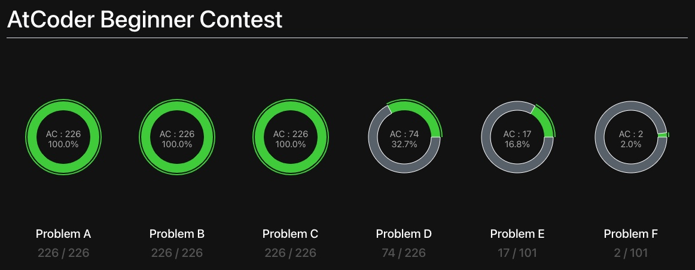
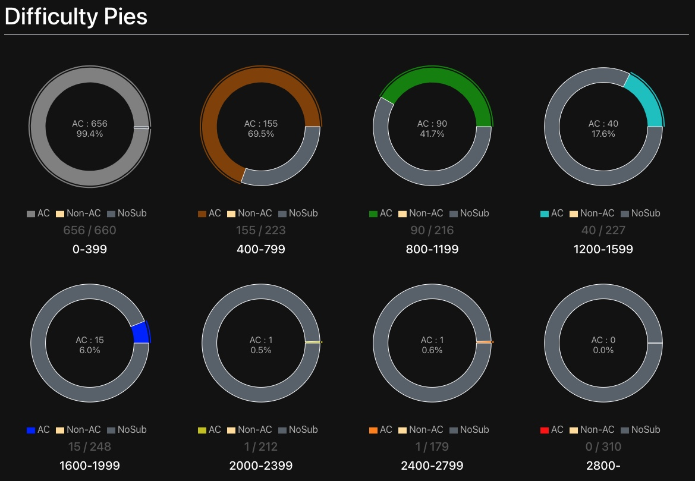
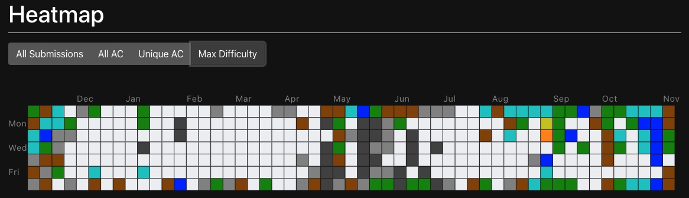
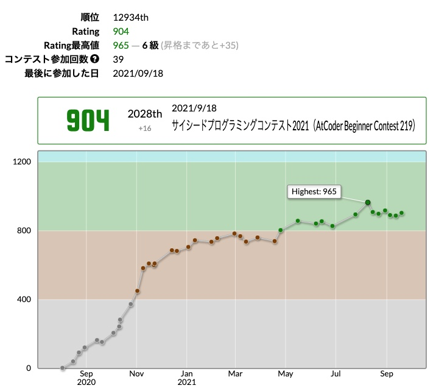

## ABC精進の状況

AtCoder Begginer Contestの過去問のうち、C問題まで（$226\times3=678$問）を解き終わりました。

ここまで解けば本番でもC問題はまあ落とさないだろうという感覚があります。

最近だとC問題を見て即座に解き方がわからないと苦々しい気持ちになりますが、よくよく思い返せばAtCoderを始めたばかりのころは、Pythonも分からなければC問題もなかなか解けなかったのを考えると着実に進歩していると言ってよいでしょう。

ちなみに、Difficulty Piesはこんな状態です。

直近、TwitterでFFの方が水色に[色変されていた][1]んですが、いやはや緑〜青diffの解いている量に大きく開きがあります。

[1]: https://bit-kyopro.hatenablog.com/entry/2021/11/10/202718

灰〜茶などの虚無埋めゾーンは私のほうが解いていますが、半分以上は《やるだけ》の問題になっているので、解けない問題が解けるようになるというよりは、解くスピードが向上するのにしか寄与していない感じです。

やはり、強くなるには高難度を解かないと始まらないと痛感しました。

ヒートマップを見ても、直近ようやく少し高難度にも触れ始めている程度で、実力の伸びていない期間は簡単な問題しか解けていないのが分かります。

幸いにしてABCとして存在する茶diffまでは今日時点ですべて解き終えたので、今後は自動的に緑diff以上を解くことになります。

自然とヒートマップも青っぽくなるはず……（解くこと自体をやめなければ）。

## 水色へ

最近、妻が2人目を妊娠して絶賛つわり感謝祭が開催中なのでコンテスト自体に出れていません。

といっても半分は言い訳で、出ていた回も直近数回はかなり停滞しているので、結局のところ解ける問題の種類を増やさないことにはお話にならないのは厳然たる課題として立ちはだかっています。

レートが伸びなかったり問題が解けなかったりすると、自分の**知能**や**人生の意味**が乏しく感じられるので、自己肯定感を高めていく意味でも愚直に精進していく所存。

## 数学が苦手？

私はもともと算数があまり好きではなく、数学もそんなに好きではない学生生活を送っていました。

そんな私も、高校は県立浦和という超一流ではないものの、それなりの進学校に通っていましたが、高校入学後の数学のテストで一度だけ満点を取ったことがあります。

当時、満点を取ったのは学年で私ともう一人だけで、もう一人（奇しくも友人である）は、東工大をトップ合格しました。なんだ自慢か、と思うかもしれませんが、ところがどっこいです。

一方の私といえば、日夜ゲームセンター通いに明け暮れたことで、高2の時点の数学でテストの点数がクラスで下から数えたほうがはるかに早いというレベルまで落ちぶれていました。

あまりにも勉強を怠りすぎて父親からぶっ飛ばされたのを覚えています。

そもそも小学生の時点から算数があまり好きではなかったのに加え、このあたりの圧倒的な演習量不足とテストの低成績が、私の数学への苦手意識を強固なものとしたのは間違いないでしょう。

## 数学のクイズ性

話が本題からぶれてきましたが、これはいつものことなので、気にせず書き進めます。

思うに競プロも数学も、どれだけ《知っているか》が第一関門にある気がしています。

一部の天才を除いて、あざやかで頭のいい解法をゼロベースで自ら見出すことはほとんどないでしょう。

もちろん《公式の丸覚え》的な本当に鈍くさいやり方の話をしているのではありません。一定の抽象化を挟んだうえでの典型パターンのようなものをどれだけ知っているかは、問題を解く能力をかなり左右するという話です。

似たような事象に、論理パズルなどもあります。

自分の帽子が見れない状況で前の人間の帽子の色だけを見て自分の帽子の色を当てる問題であるとか、正直者と嘘つきを見分ける問題であるとか、です。

競プロをやる前は、そんな状況すら忘れてしまい認知できない状態にありましたが、問題が解けない事態に直面するにつれ、抽象化された知の蓄積が、こと数学分野においては自分は乏しいのだと感じることが増えました。

## 中学受験の人工培養

これらの問題を解決するにあたり最近思うのが、超難関校の算数の中学受験問題が役に立ちそうだということです。

解法のパターンや思考法をしっかり身につけていくことで、いわゆる《地頭のよさ》を人工培養できるシステムだと思います。

結局、中学受験とか、ああいう本当にまだ若いうちに本気で知の獲得に勤しむ姿勢が必要だったんだと切に感じている次第です。

とはいえ、もう遅いと諦めるつもりは毛頭なくて、逆に言えば、**その取り返しを競プロで実現したい**というのが自分が競プロに見出している価値なのかなーと改めて思いました。

自分が開成だとか東大だとか、そういう層には食い込めない人生を送ったのも、確実に妥協がもたらした帰結です。頑張り切ることができない弱さ。

当時もことさら開成だとか東大に行く人生を歩みたいとは思っていないつもりでしたが、まあ競プロの上位層などを見ると、そんな程度の水準は行きたいと思おうが思わないが凌駕しているみたいなレベルの人が散見されるので、自分の無力さに歯がゆさを覚えたりもします。

このまま世間一般のレベルで人生を終えたくない、という気持ちだけが高まっていき、実力と理想がミスマッチしているのが最高にダサいと感じている今日このごろですね。
