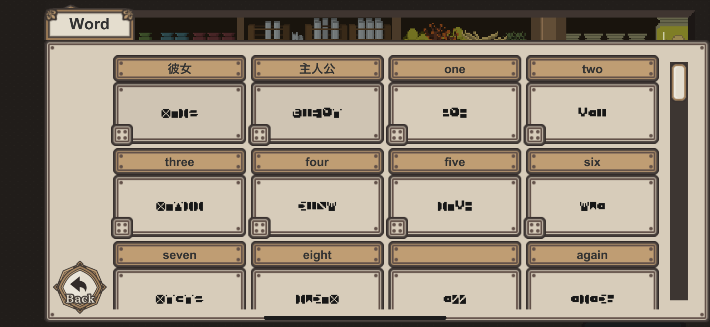
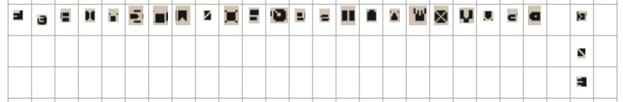

## 7 Days to End with You

めずらしくゲームの話です。

どんなゲームをやっているのかについては[こちらの記事](https://www.4gamer.net/games/615/G061518/20220124091/)で。

## ネタバレ

ネタバレ①

 

**ヒントはカレンダー。**

規則的に並んでいることから数字であるのがわかる。

さらに、これを英単語にして埋めていくと、文字数が完全に一致することがわかる。

しかし、同じアルファベットでも単語が違うと対応する文字が違うこともわかる。

ネタバレ②

 

- ネタバレ①で得た数字の情報と本棚の本を組み合わせると色の表現が推測できる
- 2階の部屋で大小に関する表現が推測できる
- 数字と色がわかると、植物の世話や料理が正しく作れるようになる

ネタバレ③

 

**地道に対応表を作っていくと、単語ごとに対応する文字は違うとはいえ、並び順に関しては一定そうなのがわかる。**

まだ未完成だが、おおむね以下のような並び順になっていそうだ。

ネタバレ④

 

2階の実験室にある棚をよく見ると、不自然に何も置かれていない段がある。

触ろうとすると、「no」「touch」と言われるが……。

ネタバレ⑤

 

訪問イベントで、助けに行かず待っていると2階で〈何か〉をしたあの人が降りてくる。

「some」で回答する。

## おわりに

解読が進みつつあって、かなり楽しい。

わかり次第、追加していこうと思う。
