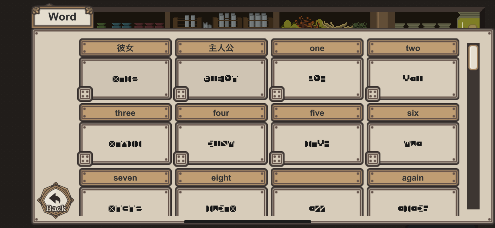
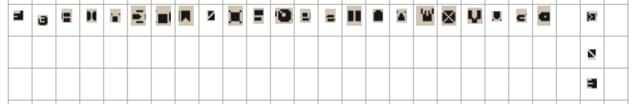

## 7 Days to End with You

めずらしくゲームの話です。

どんなゲームをやっているのかについては[こちらの記事](https://www.4gamer.net/games/615/G061518/20220124091/)で。

## ネタバレ

ネタバレ①

 

**ヒントはカレンダー。**

規則的に並んでいることから数字であるのがわかる。

さらに、これを英単語にして埋めていくと、文字数が完全に一致することがわかる。

しかし、同じアルファベットでも単語が違うと対応する文字が違うことがわかる。

ネタバレ②

 

**地道に対応表を作っていくと、単語ごとに対応する文字は違うとはいえ、並び順に関しては一定そうなのがわかる。**

まだ未完成だが、おおむね以下のような並び順になっていそうだ。

## おわりに

解読が進みつつあって、かなり楽しい。

わかり次第、追加していこうと思う。
