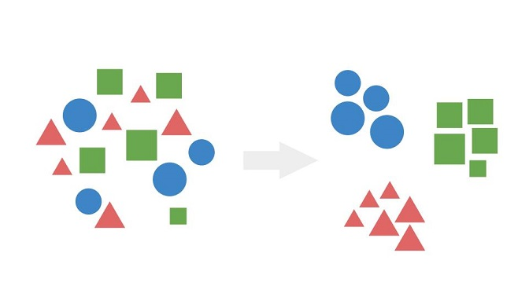
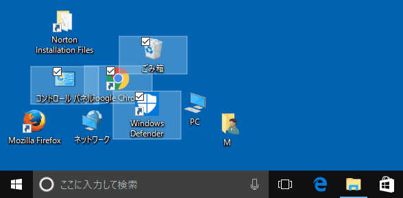
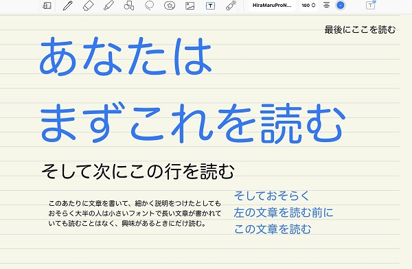

## はじめに

チームの方との会話で「このあたりの共通認識を持っているのは大事だよね」という話になり。

その勢いで社内ブログに書いた内容が汎用的だったので、本ブログにも持ってきました。

## デザインとアートを混同してはいけない

**「近接・整列・反復・コントラスト」**

[ノンデザイナーズ・デザインブック](https://amzn.to/3ssTa9z)に書かれているデザインの〈4つの基本原則〉です。

この4原則の話をする前におさえるべき前提があります。

**デザインとアートは違う**、ということです。

デザインは乱暴に言ってしまえばエンジニアリングです。
つまり、理論に基づく方法論です。

万人がピカソの絵を書けるようになる方法論はありませんが、  
理解しやすいドキュメントを作ることは方法論に従えば可能です。

デザインに感性や曖昧さを見出すのはアートとの混同です。  
ここの理解がないと大抵の場合、話がこじれます。

まずは、デザインとアートを峻別しましょう。

## デザインの4原則

デザインに限らずそうですが、小手先のテクニックより先に原則を学ぶことが大事です。  
「近接・整列・反復・コントラスト」の4原則を最初に学びましょう。

これらは互いに密接な要素であり、どれか1つだけ使えばいいという類のものではありません。

### 近接

**同じ系統のもの（関連する項目）は位置を近づけましょう。**

これをやっていない資料は、同じカテゴリの商品が全く別の陳列棚に並んでいるスーパーと同じです。  
つまり読み手に負担を強いています。

加えて認識しておくべきことがあります。  
似たものを近づけるというのは、反対に〈**似てないものは離す**〉ということです。

### 整列

**揃えましょう。**

ズレているのは気持ちが悪いものです。

[^1]

[^1]: https://www.billionwallet.com/windows10/desktop-grid.html

整列されていない無秩序なものを見ると認知負荷がかかります。

ここでも逆の見方が有効です。  
揃えるとはつまり、揃っていないものは例外なく〈**揃えないことに意図がある状態**〉です。

無秩序を放置すると、揃っていない部分が意図的な配置なのかそうでないのか読み取れなくなります。

### 反復

**反復は、近接と整列の合わせ技です。**

具体的に言いましょう。  
文書なら同じレベルの情報に同じレベルのインデントをつけることは反復にあたります。

たとえば、この箇条書き。

- 可食部
- 卵
- 白身
- 殻
- 不可食部
- 黄身

たしかに整列はされているものの、整列だけしても近接の原則が守れていないと認知負荷は極端に上がります。

- 卵
  - 可食部
    - 黄身
    - 白身
  - 不可食部
    - 殻

このように、同じレベルの情報を同じレベルのインデントにしましょう。

近接がグループ化だとすれば、グループを整列しレベルごとに構造化することが反復です。  
**これはまさしく分類学です。**

これ、本当にちゃんとしてない文書ばかりです。世の中の文書の140%くらいができていません。

必要なのはMECEに分類することです。  
間違ってもこの箇条書きに「卵かけごはん」を追記するような暴挙はやめましょう。

卵ならわかりやすいので間違える人は少ないですが、やってること自体は以下に近い例をよく見ます。

- 卵
  - 可食部
    - 黄身
    - 白身
    - **卵かけごはん**
  - 不可食部
    - 殻
  - **醤油**

そういえばROLANDは「俺か、俺以外か」でMECEですね。意味のあるMECEかは分かりませんが。

### コントラスト

**コントラストは注目すべきものを目立たせることです。**

つまり目線のコントロールです。

> Contrary to popular belief, Lorem Ipsum is not simply random text. It has roots in a piece of classical Latin literature from 45 BC, making it over 2000 years old. Richard McClintock, a Latin professor at Hampden-Sydney College in Virginia, looked up one of the more obscure Latin words, consectetur, from a Lorem Ipsum passage, and going through the cites of the word in classical literature, discovered the undoubtable source. Lorem Ipsum comes from sections 1.10.32 and 1.10.33 of "de Finibus Bonorum et Malorum" (The Extremes of Good and Evil) by Cicero, written in 45 BC. This book is a treatise on the theory of ethics, very popular during the Renaissance. The first line of Lorem Ipsum, "Lorem ipsum dolor sit amet..", comes from a line in section 1.10.32.

上の例はコントラストがありません。

> Contrary to popular belief, **Lorem Ipsum** is not simply random text. It has roots in a piece of classical Latin literature from 45 BC, making it over 2000 years old. Richard McClintock, a Latin professor at Hampden-Sydney College in Virginia, looked up one of the more obscure Latin words, consectetur, from a **Lorem Ipsum**
> passage, and going through the cites of the word in classical literature, discovered the undoubtable source. **Lorem Ipsum** comes from sections 1.10.32 and 1.10.33 of "de Finibus Bonorum et Malorum" (The Extremes of Good and Evil) by Cicero, written in 45 BC. This book is a treatise on the theory of ethics, very popular during the Renaissance. The first line of **Lorem Ipsum**, "**Lorem ipsum** dolor sit amet..", comes from a line in section 1.10.32.

コントラストを付けました。  
この文章が何を言っているかはわかりませんが、〈**Lorem Ipsum**〉だということはわかりました。

ぐちゃぐちゃ羅列してあるだけの情報は認知負荷が高いです。

「で、何が言いたいの？」  
「で、どこを見ればいいの？」

そう言われて終わりです。

コントラストの強弱で〈**読者の目線が向く順番**〉を作り手がコントロールしてあげることが必要です。

目線の〈順番〉コントロールの具体例を挙げましょう。

[^2]

[^2]: https://twitter.com/TaRo_physics/status/1479822142212808704?s=20&t=8PJyAIjbuf5yAVKSHm27lg

## おわりに

資料の作成とは読み手の認知負荷を下げることです。

とにかく、**読み手のコストを意識しましょう。**

もちろん、書き手のコスト削減も大事です。でも書き手は基本1人です。

読み手のコストは読み手の**人数分**だけかかります。

どうせコスト削減するなら局所最適化せずに大局的にやりましょう。

つまり、多くの人が見る資料、何度も使われる資料では、**読み手のコストを強く意識しましょう**。
