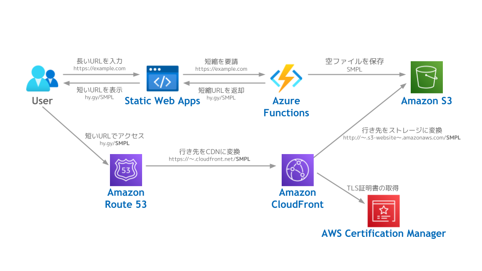

## URL短縮サービス、つくってみた

URL短縮サービスというと、今はもう~~サービス終了してしまったらしい~~（訂正：サービス終了したのはGoogleの短縮サービスでbitlyはまだ残ってました）が、bit.lyなんかが有名だったと思う。

ことTwitterの場合、今ではURL短縮の恩恵というのはほぼない。というのもどんなに長いURLでも消費字数が一定となったからだ。

しかし、Twitterのように《よしなに》やってくれない媒体のうえでURLをやりとりする場合は、やはり長ったらしいままだと扱いが面倒なこともある。

たとえば、チャットで長いURLを打つと改行の処置に困ったりする。まさに、欲しいときはそこそこ欲しいレベルの存在だったりする。

とはいえ、冒頭で書いたとおり、URL短縮サービス自体が終了してしまうとそのリンクが死んでしまったり面倒なので、自分の責任でコントロールできるものを作ろうと考えた。

あと、より根源的な理由として「題材はどうあれ自分で開発したものがある」を実現したいというのがある。

### 先に実物をば

作ったのは[このサイト](https://url.thanaism.com)だ。

テスト製作として、Webからの一般アクセスだとリンクの有効期限は1日となっている。

Twitterアカウントでログインすると無期限のリンクが作成できるようになる。
いずれ全公開するつもりなのでAPIを直で叩けばログインしなくても無期限のリンクが作れたりはする。

[GitHub](https://github.com/thanaism/thanai-url)のコードを読めば、どんなパラメータを指定すればいいかは解読できるので、ここではあえて説明はしない。

一応、ログインしなくてもログインしている状態になるデモページも作ってはあったりするが、知人への紹介用に留めようと思う。

## 維持費はできるだけ抑える

自分でサービスを作る場合の鉄則は、とにかく維持費を無料にすることである、というのを以前どこかで読んだことがある。

探してみたら[この記事](https://qiita.com/jabba/items/1a49e860a09a613b09d4)だった。

> でもサイト運営は開設してからが勝負だ。数ヶ月経ってもあまり反響が無いとする。
> そこで「いやいやもうちょっと後半年ぐらいはメンテして」と考えた際に「月に数千円✕数ヶ月分」とすると高額になってくる。
> ＊＊万円か、、、だったらやめよかな、となりがち。

実際そうだと思うので（とくに短縮URLなど寿命が命だ）、できるだけ無料に寄せた構成にした。

ドメイン関連以外はほぼゼロ円に近い運用ができる。

ドメインにかかる金額だが、独自ドメインの維持費が年間で約3000円ほどと、Route 53のHostedZoneが毎月0.5ドルだけかかる。

すでに持っているドメインのサブドメインを切り出すこともでき、その場合はドメイン関連のコストもなくすことができる。しかし、URL短縮の矜持として極短のドメインは必須事項だと考えて甘んじて受け入れることにした。

なーに、ドメインは他でも使えるのでURL短縮だけに消費されるわけではないのだよ！問題はないさ！（なお、他の使い道は思い付いていない）

## 実際の構成

-   フロントエンド：Azure Static Web Apps
-   バックエンドAPI：Azure Functions（Azure SWAマネージドなFunctions）
-   ストレージ：Amazon S3
-   CDN：Amazon CloudFront
-   DNS：Amazon Route 53
-   証明書管理：AWS Certification Manager

構成としては、静的サイト＋バックエンドAPIというよくあるやつ。

### Azure Blob StorageではなくS3を使う理由

バックエンドAPIは、ランダムな短縮エイリアスを生成し、そのエイリアス名のblobをS3へ保存する。S3は**blobオブジェクト単位のリダイレクト機能を持っている**ので、とくにサーバーサイドで転送の処理を気にする必要はない。

Azure Blob Storageにはオブジェクト単位のリダイレクトの機能がない（というかリダイレクト機能自体がない）ので、やるとしたらrefreshタグを仕込んだHTMLを保存するという古臭い方法になる。

当初は、リダイレクトページに広告を貼って「○秒後に自動で転送されます、転送されない場合はこちらをクリック」みたいな**太古の時代にはよく見たアレ**で作ろうと思ってAzure Blob Storageで作ってみたのだが、自分が使うことを考えるとウザすぎるのでやめた。

たとえrefreshタグの時間指定を0秒にしたとしても、301リダイレクトより様々な面で劣るのですべてをAzureで完結させることは諦めた。

ちなみにAzure CDNやAzure Static Web Appsの転送ルールでどうにかできないかも検討したが、ルール数または設定ファイルのサイズに上限があり、URL短縮サービスとして期待されるレベルのスケーラビリティが全くないのでダメだった。

### S3のHTTPS化

今回、ユーザーが独自ドメインでblobへアクセスできるように別途DNSとCDNを導入している。

というのもS3の静的サイトホスティング単体ではHTTPSをサポートしておらず、CloudFrontをかぶせてやるのが必須の対応となる。

で、HTTPS化にあたっては当然ながら証明書を発行しないといけないのだが、AWSだとAmazonが認証局なのでAzureと違ってネイキッドドメインでも無料で証明書を発行してくれる（Azure CDNの場合は、サブドメインのみ）。これに関しては本当にすばらしいと感じた。

Azureでネイキッドドメインの証明書をどうにかしようとすると、まず証明書自体はLet's encryptで無料で発行してくることができる。しかし、その証明書をAzure Key Vaultに保存するのに3米ドルくらいかかる。Azure CDNは、Azure Application Gatewayなどと違って、証明書の直接アタッチができないようなので、Key Vaultが必須となるのだ。

Let's encryptの証明書の有効期限も考えると年間で無視できない額になってくるので頭痛のタネだったりする。

### CDNをネイキッドドメインに紐付ける

CDNの実体は、グローバルに分散されたキャッシュサーバーである。
つまり、Aレコードに一意なIPアドレスを登録してやるみたいな処置はできない。

で、サブドメインなら普通にCNAMEを登録してやれば済む話なのだが、ネイキッドドメインにCNAMEを設定することはRFC的に禁じられていて出来ないらしい。

どうすればよいかというと、DNS自体もAWSで用意してやれば、本来IPアドレスを指定する必要があるAレコードであっても、CDNリソースを対象にして登録することができる。

全部がAWS内で完結する話なので、好きにできるからだろう。
CDNの配置に応じて動的にAレコードを割り当てているような状態に、いい感じにやってくれるっぽい。

このあたりの仕組みはAzureにもあって、Azureの負荷分散サービスをネイキッドドメインに割り当てたいならAzure CDNを使えばよろしい（ただし証明書まわりはAWSより高額になる）。

## React/TypeScript

これまで、ほんのうっすらだけReactやTypeScriptを触ったことがあったが、真面目に環境構築して作ったのは初めてだった。特に大きな違いとしてはeslintがある。

### eslintにフルボッコにされる

eslintを導入したのは初めてだったので、普通に書いたらリンターに死ぬほど怒られた。が、それをどうにか回避するためにいろいろ調べたりして、お作法的なところがだんだんとわかるようになってきたので、非常に喜ばしいと思っている。

なんでeslintに至ったかというと、買うだけ買って詰んでいた[「りあくと！」本](https://booth.pm/ja/items/2368045)によるところが大きい。ぶっちゃけ、これがなかったら単に動くだけのクソみたいなコードが量産されていたと思う。

それほどまでに、現代のスタンダードを理解できていなかったし、それに気付けたことが大きな収穫だった。

もちろん、まだすべてをしっかりと理解したとは言えないが、少なくとも目指すべき方向性のようなものを認識することができ、以前の自分とは雲泥の差だと感じている。

### FaaSのAPIもTypeScript

今回、フロントだけではなくて、FunctionsもTypeScriptで書いた。

同じプロジェクト内でフロントとAPIが違う言語だと、コード内で似たようなワークアラウンドを行う際に書き直す手間が発生するし、せっかくTypeScriptをやるならこの機会に一気に慣れたいという意図もあった。

さらに付け加えるならば、Azure Static Web Appsに組み込みの従量課金Functionsには使用可能な言語に制約があり、Node.jsのほかには、Pythonか.Netしか選択肢がない。

.Netに至っては競プロレベルも含めて**まったく**書いたことがなかったのと、そもそも興味があんまりないというのもあって、真っ先に選択肢から外れた。

Pythonは、競プロでしばらく使っていて手に馴染んだ言語ではあるが、できることを繰り返しても成長はしないので候補から外した。

APIの軽量化・高速化の観点でいうと言語選択にはもっと最適解があるのかもしれないが、とはいえTypeScriptに加えてGoも新たにやりますとかなると完成するまでの寄り道が大変なことになりそうなので、そこに検討のコストを割くことはしなかった。

そもそも別の言語を使うために組み込みのFunctionsを使わない選択肢をとる場合、CI/CDのビルドパイプライン構築にカスタマイズが必要になるのでわりと面倒なのもある。そこまでやるならLambdaも試してみようかな、となってしまうことが容易に予見され、収集がつかないと判断した。

## だいたい1週間くらいで第1版ができた

GitHubを見ると最初のコミットが[4月12日][1]で、これがAzure Static Web Appsに登録するための最低限のCreate React Appをした状態。

[1]: https://github.com/thanaism/thanai-url/commit/2924f325c9f1bc4e6092730894719eff04d0c549

そこから、URLが短縮されるという状態のサイトを公開したのが[4月16日][2]で、これがIPAの試験前日だったのを覚えている。が、この時点ではさっき書いたようなAzure Blob Storageを用いたrefreshタグでの実装であんまりイケてなかった。

[2]: https://github.com/thanaism/thanai-url/commit/1f6d7dc59033c094bd3b5a93211c7c6239b21de5

で、Twitterで公開したら案の定「Twitterのリンクカードにリンク先の情報が反映されてほしい」という感想をもらい、このままではいかんと思い、AzureサービスをAWSに置換していった。

[4月18日][3]になると、S3に置換した形のコードをアップしているようなので、この時点で構成としては現時点と同じものになっているはず。ここまで約1週間。

[3]: https://github.com/thanaism/thanai-url/commit/4c24319925db249b18f52b91811c7d8c7b49810a

## 個人サービスをつくっている人たちのすごさを痛感

ちょうど作ろうと思ったのがIPAの試験のある週で、当然ながら本業も普通にあったという言い訳をすればそれまでだが、正直、思ったよりもかなり時間がかかった。

言ってしまえば、URLに対してランダムなエイリアスを割り当てて、重複してなければそれをストレージにアップするという、ただそれだけのプログラムである。まあ、どちらかといえば今回は安く抑えるのにインフラのシステムありきなサービスな気がするので、プログラムの単純さだけでは測れないのかもしれないが、それを言ってしまったら本業はクラウドエンジニアなわけで、そこは出来て当然だからむしろ墓穴を掘ってしまうとも言える。

こうして考えると、普通に仕事をしながら多くの人に使われるようなリッチなサービスをつくっている人たちは本当にすごいと感じた。漫画だったら「力が欲しいか……」とか問われてるくらいの心境。

まあ今回、単純なものとはいえ実際に作ってみると非常に楽しかったので、他の題材を思いついたら作ってみようと思う。
