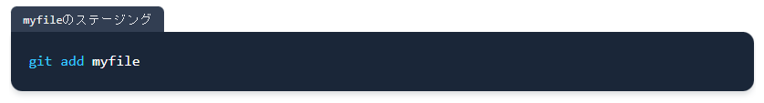

# 本記事の対象

この文章では主に、

-   Markdown形式で、
-   内容にコマンドやコードが含まれる

ような文書を想定して書く。

# コードやコマンドへの配慮

コードやコマンドは**実際にコピペして使用するケースが多い**ので、利用者（未来の自分を含む）が嬉しくなるように書く。

## コードブロックの使用

まず、コマンドやコードは地の文にベタ書きせず、**必ずコードブロックで囲う**。

### 具体的には

git commit --amend -m 'This is my special commit message'

👆こう書かずに、

---

```bash
git commit --amend -m 'This is my special commit message'
```

👆こう書く。

## インラインコードブロックの使用

単語レベルであっても、コードに類する記述はベタ書きせずに**インラインコードブロックを用いて区別する**。

### 具体的には

KubernetesのL4ロードバランサーの指定には、type: LoadBalancerをYamlに記述する

👆こう書かずに、

---

KubernetesのL4ロードバランサーの指定には、`type: LoadBalancer`をYamlに記述する

👆こう書く。

## ファイル種別の記入

コードブロックでは、**シンタックスハイライトのためにファイル種別を指定する**。

指定の方法は下記。

````
```yml
# これはYamlファイルです
# バッククォートのあとにファイル種別（≒拡張子）を記入します
```
````

### 具体的には、

```
[...Array(100)]
    .flatMap((_, i) => ((i + 1) % 3 === 0 ? ['Fizz'] : ['']))
    .flatMap((v, i) => ((i + 1) % 5 === 0 ? [v + 'Buzz'] : [v]))
    .flatMap((v, i) => (v === '' ? i + 1 : v));
```

👆こう書かずに、

---

```js
[...Array(100)]
    .flatMap((_, i) => ((i + 1) % 3 === 0 ? ['Fizz'] : ['']))
    .flatMap((v, i) => ((i + 1) % 5 === 0 ? [v + 'Buzz'] : [v]))
    .flatMap((v, i) => (v === '' ? i + 1 : v));
```

👆こう書く。

## 長いシェルコマンドの改行

横スクロールが必要なコードブロックは非常に読みにくいので、**長すぎるコマンドは改行する**。

また、コマンドの単位が分かりやすいように**2行目以降はインデントする**。

### 具体的には

```bash
az aks create --resource-group sample-rg --name sample-aks --node-count 3 --node-vm-size Standard_B2ms --network-plugin azure --vnet-subnet-id $SUBNET_ID --attach-acr $ACR_ID --dns-name-prefix sample-aks
```

👆こう書かずに、

---

```bash
az aks create \
  --resource-group sample-rg \
  --name sample-aks \
  --node-count 3 \
  --node-vm-size Standard_B2ms \
  --network-plugin azure \
  --vnet-subnet-id $SUBNET_ID \
  --attach-acr $ACR_ID \
  --dns-name-prefix sample-aks
```

👆こう書く。

## 環境変数の使用

Azure CLIでリソースを作成する場合など、一連の作業でリソースグループ名を何度も使ったりする。

このような場合、例示するコマンドにリソースグループ名がリテラルで入っていると利用者側が毎回書き換える必要が出てきてしまう。

利用者サイドでの書き換えが頻発する値は、**リテラルではなく環境変数で記載する**。

### 具体的には

```bash
az group create -l japaneast -n sample-resource-group-name
```

👆こう書かずに

---

```bash
RESOURCE_GROUP=sample-resource-group-name
```

```bash
az group create -l japaneast -n $RESOURCE_GROUP
```

👆こう書く

## シェルコマンドの先頭に`$`を記載しない

シェルコマンドであることを明示するために`$`を記載しているケースが多いが、コピペがしにくくなる。

とくにトリプルクリックで行選択することに慣れている利用者にはうっとうしい存在だ。

そうでなくとも、QiitaやZennなどの場合、各コードブロックにコピーボタンが実装されていたりするし、ゴミが混じるのは利用者に余計な手間を発生させる。

**シェルコマンドの先頭に`$`を付記するのは避ける**ことが望ましい。

### 具体的には

```bash
$ git merge --no-commit --no-ff
```

👆こう書かずに、

---

```bash
git merge --no-commit --no-ff
```

👆こう書く。

### 補足

<details><summary>長いので折りたたみ</summary><div>

Twitterで[コメント](https://twitter.com/ussvgr/status/1528719031183998981?s=20&t=0rLxoOouTC2VvzHKoExJZw)があった。

`$`や`#`や`%`を先頭に付記することで、そのコマンドを実行する主体が管理者ユーザーなのか一般ユーザーなのかを示す場合がある。

しかし、`#`には注意が必要だ。

コマンドを記述するコードブロックに`sh`や`bash`を指定している場合、コメント行として解釈されてしまう。

これを回避するには、`bash`ではなく`shell-session`を指定する必要があるが、認知度が低いと思われる。

````
```shell-session
# tail -f /var/log/messages
```
````

```shell-session
# tail -f /var/log/messages
```

また、ユーザーの権限を意識せずに書かれてしまっている文書（私の文書である）も散見されるため、**意図して`$`なのかが判別しにくい**。

そのため、その明示には`sudo`を用いることをおすすめしたい。

Ubuntuの場合、デフォルト状態ではrootのパスワードは設定されていないし、`su`を使うケース自体が少ないと考えられるのもある。

ただし、一部設定にシングルユーザーモードが必須なミドルウェアなんかがあるらしく、その場合はrootログインせざるを得ないようだ。

とはいえ、そういうケースだとコマンドの先頭文字だけでなくもっと文章で明示する必要があるだろうから、やはり先頭の`$`付記はやめたほうが多くのケースで幸せが増える気がしている。

（「それでも先頭の`$`付記は必要だ」という合理的な理由をお持ちの方がいたらぜひこの記事の画面右上にあるTwitterアイコンから私のアカウントにむけてリプライなりDMなりをもらえると嬉しい限りである）

</div></details>

## 複数のコマンドを1つのコードブロックで書かない

これには若干の賛否両論があるかもしれないが、コマンドが複数ある場合は、**コマンドごとにコードブロックを分けることが望ましい**。

上の「シェルコマンドの先頭に`$`を記載しない」に則っている場合は、複数コマンドをまとめてシェルに貼り付けられるので、分けない方がよいと考える読者もいるかもしれない。

が、コマンドごとの区切りが曖昧だと、コピペミスに気付かずに思わぬコマンドを道連れで実行してしまったりするミスに繋がる。

連続で実行してなんら問題ない場合は、コマンド自体を連結しておけばよく、基本的にはコマンドごとにコードブロックを分割したほうがよいと筆者は考える。

また、コマンド自体を吟味し、**複数の引数を取れるかなどもチェックする**。

### 具体的には

```bash
git add my-first-staging
git add my-second-staging
git commit -m 'commit 2 files'
```

👆こう書かずに、

---

```bash
git add my-first-staging my-second-staging
```

```bash
git commit -m 'commit 2 files'
```

👆こう書く。

---

```bash
git add my-first-staging my-second-staging && git commit -m 'commit 2 files'
```

👆あるいは、こう書く。

## ファイル名の表示機能を活用する

これはQiitaやZennなどの場合に限る。

QiitaやZennではコードブロックにファイル名のラベルを表示してくれるので、これを最大限活用する。

ファイル名を記載するのはもちろんのこと、コマンドの意図を現すのにも使える。

````
```yml:foo.yml
# このようにコロンに続けてファイル名を書く（QiitaまたはZennの場合）
```
````

### 具体的には

`myfile`をステージングする。

```bash
git add myfile
```

👆こう書かずに、

---



👆こう書く（※Zennの例）

# おわりに

現時点で思い付いたのは上記だが、今後ほかに気付くポイントがあれば追記する予定。
