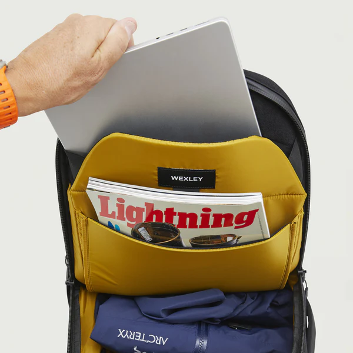

## MacBookを直接しまえるカバンがほしい

これまで新卒祝いで父に買ってもらったMAMMUTのリュックをずっと使っていたのだが、いかんせんPCをしまうのに別途PCケースが必要でちょっと不便さを感じていた。

で、去年の初頭にこんなツイートをした。

<blockquote class="twitter-tweet">
ふだんカフェ作業とかやってる方、MacBookの持ち運びってどんな風にやってますか？  ①なんらかの防護ケースに入れてカバンにインする ②直接インできるいい感じのカバンを使っている ③漢は黙ってノーガード  インドア派なものでこれまで持ち歩くことほとんどなかったのでおすすめ聞きたいです
&mdash; タナイ (@okinawa__noodle) <a href="https://twitter.com/okinawa__noodle/status/1614462631393529857?ref_src=twsrc%5Etfw">January 15, 2023</a></blockquote> 

そしたらフォロワー各位から多くのおすすめが集まったのだが、中でもAerとWEXLEYというメーカーがよさげな感じであった。

よくよく聞くと、WEXLEYはAerにOEM提供しているということで、自分の選球眼の一貫性に感心しつつも、その2つのメーカーの中だけでも非常に選択肢が多いと気付く。

なるほど選択肢が多すぎると人はかえって自由を失うのだと実感した次第である。

そこから早5000年ほどが経ったが、どれを買うか出張前に悩んでは、悩んでいるうちに出張当日までに配送が間に合わなくなり購入を見送るということを10億回ほど繰り返していた。

ちなみにこの記事を書いている2日前にも出張があったのだが、例にもれず自らの決断力のなさを後悔しながらの移動となった。

## たまたま先月は給料が多かった

実は、勤め先で給与支払いタイミングの更改があり、これまで当月締めの翌月払いだったのが、当月締めの当月払いになった。

それに伴い先月は切り替わり月としてなんと2ヶ月分の給与が支給されたというわけだ。

まさにお祭り状態、財布の紐はガバガバである。

というわけで、出張中の後悔の記憶も新しいうちに、WEXLEYのバックパックを買う決断をした。

購入したのは、「ACTIVE | BUSINESS PACK - CORDURA® NYLON / CARBONATE」というモデル。

公式サイトでの定価は、23,100円だった。

https://wexley.jp/products/active-business-pack-cordura%C2%AE-nylon-carbonate?_pos=2&_sid=50efdfd22&_ss=r

## 買った決め手はYouTubeのレビュー動画

令和は本当に良い時代で、何を買うにしてもYouTubeを見れば詳細なレビュー動画をすぐに見つけることができる。

もちろん中には多少のプロモーションはあれど、それでも通販サイトの画像と文字だけを見るよりはるかに詳細な情報が手に入るのは間違いない。

今回良かったと思った動画はこれだ。

<iframe width="560" height="315" src="https://www.youtube.com/embed/rNk7rg2ga5E?si=PUY1i2vmvVNMUJNj" title="YouTube video player" frameborder="0" allow="accelerometer; autoplay; clipboard-write; encrypted-media; gyroscope; picture-in-picture; web-share" referrerpolicy="strict-origin-when-cross-origin" allowfullscreen></iframe>

さっき注文したばかりなので、この記事には私のレビューはないが、上記の動画で充分だろう。

## そして勢いのままMagSafeデビュー

積年の悩みと後悔からの解き放たれ、物欲というジャスティス、魂の解放を感じた私はすぐさまAppleの公式サイトに飛び込んだ。

以前から気になっていたMOPHIEというブランドのMagSage対応モバイルバッテリーのことを思い出したからだ。

https://www.apple.com/jp/shop/product/HQ332ZM/A/mophie-powerstation-10k-stand-with-magsafe

## MagSafeにはカス製品がある

同じMagSafe対応と謳っている商品でも、その充電速度には注意が必要だ。

一般的なUSB-C経由の充電はおよそ20Wである。これは機種にもよるが、たとえば最新のiPhone 15 Pro Maxであれば、25.5Wらしい（27Wと書いている記事もあった）。

ちなみに、iPhone 11以下であれば最大18W、iPhone 12や13であれば最大20Wである。

ところが、チャチなMagSafe対応製品は、最大5Wだったりする。まごうことなきゴミと言える。

どうもMagSafeはApple純正でないと、最大7.5Wという制限を設けているのか、気を付けようにもAmazonで検索して出てくるようなMagSafe充電器は軒並み最大7.5Wである。

## MOPHIEは最大15Wだ

しかし、今回選んだMOPHIEのMagSafe対応モバイルバッテリーは、最大15Wでの充電に対応しているとAppleの公式サイトに記載がある。

私の調べた範囲では、モバイルバッテリーの形式で最大15Wの充電に対応しているのはMOPHIEだけだった。

## iPhone 12 miniの純正MageSafe対応ケースが終売

すばらしいモバイルバッテリーを注文したところで、iPhoneケースもMagSafe対応にしようとして純正品が終売になっていることに気付いた。

これは困った。こっちは物欲を持て余しているんだ。どうしてくれる。

## 困ったときのメルカリ

というわけで、メルカリで探してみたら、そこそこきれいな中古品が2000円くらいで出品されていたのでポチった。

終売なのをいいことに、バキバキに割れたケースを数千円で売っている輩が散見され、足元を見るのがうまい連中だと感心した。

やはり人生で大切なのは、人に金を払わせることに申し訳なさを感じない能力だ。

完全に話が逸れるが、私の経験上、そのあたりが非常に下手くそな人間がクラウドソーシングなどにはあふれている。

しかし、そのようなことを思う一方で、何の価値ももたらさない人間を大量に投入して大金をせしめる多重下請けビジネスモデルには嫌悪感を抱くのもまた事実である。

なるほど人生で一貫性を保つのは難しい。

## 反省

一貫性という意味では、反省点がある。

本当に物欲に突き動かされるままに怒りの爆買いロードを征くのであれば、ちまちま中古ケースなど探さずにiPhone 15 Proを買って本体ごと変えてしまうべきだったかもしれない。
